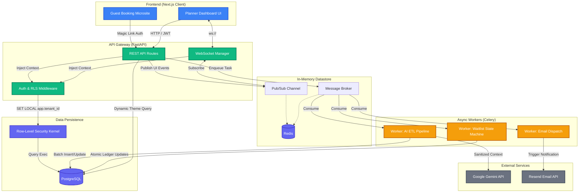

# Eventflow 🌊

> **Enterprise-Grade, AI-Driven Multi-Tenant Event & Resource Management Platform**

Eventflow is a high-concurrency B2B SaaS platform designed to automate the entire lifecycle of corporate events, destination weddings, and group travel. Built to pass the rigorous technical requirements of a top-tier system design interview, Eventflow solves complex computer science problems involving **distributed concurrency, cryptographic tenant isolation, asynchronous state machines, and real-time telemetry.**

---

## 🚀 Key Engineering Highlights

This project was intentionally architected to demonstrate deep backend proficiency and full-stack scalability:

*   **High-Concurrency Booking Engine:** Utilizes PostgreSQL pessimistic locking (`SELECT FOR UPDATE`) to guarantee strict ACID compliance, zero double-bookings, and atomic split-ledger corporate subsidy calculations during massive traffic spikes.
*   **Cryptographic Multi-Tenancy:** Injects JWT contexts directly into PostgreSQL Row-Level Security (RLS) policies, eliminating application-level filtering flaws and ensuring 100% data isolation across tenant organizations.
*   **Distributed Task Processing:** Uses Celery and Redis to power an automated waitlist state machine and Notification Center; asynchronously reclaiming canceled inventory and dispatching targeted emails without blocking the main event loop.
*   **Dynamic Headless CMS & Real-Time Telemetry:** Instantly provisions password-less "Magic Link" guest portals using Next.js 15, integrated with a real-time Redis Pub/Sub dashboard that broadcasts live inventory depletion to planners with zero HTTP polling latency.
*   **AI Data Ingestion Pipeline:** Integrates the Google Gemini API to deterministically extract structured configurations from messy corporate CSVs, implementing strict PII masking and a "Human-in-the-Loop" grid to reduce manual data-entry time by 90%.

---

## 🏗 System Architecture Diagram



---

## 💻 Tech Stack

### Backend
- **Framework:** FastAPI (Python 3.11) with Pydantic for strict schema validation.
- **Database:** PostgreSQL (Async SQLAlchemy 2.0).
- **Concurrency Control:** Database-level pessimistic locking (`with_for_update()`).
- **Security:** PostgreSQL Row-Level Security (RLS) + JWT Middleware.
- **Task Queue:** Celery (State machines, Email Dispatch).
- **Caching & Pub/Sub:** Redis (Broker, Websocket Broadcasts).
- **AI Integration:** Google GenAI SDK (Gemini 2.5) with strict JSON `response_schema`.

### Frontend
- **Framework:** Next.js 15 (React 19, App Router, Server Components).
- **Styling:** Tailwind CSS, custom CSS variable injection for dynamic theming.
- **Data Visualization:** Recharts (Real-time telemetry dashboards).
- **State Management:** Custom React Hooks utilizing WebSockets for live mutation.

---

## ⚙️ Core Technical Deep Dives

### 1. The Concurrency Engine (Zero Double-Booking)
Eventflow handles "flash sale" style traffic spikes during event registrations. Relying on optimistic locking or application-level checks causes heavy transaction rollbacks and database thrashing. Instead, we wrap room inventory decrements, split-ledger math, and booking creation in a single ACID transaction guarded by a `SELECT FOR UPDATE` lock. This serializes access at the database kernel level, mathematically guaranteeing zero double-bookings.

### 2. Cryptographic Multi-Tenancy (RLS)
Unlike standard SaaS applications that rely on developers remembering to add `WHERE tenant_id = x` to every query, Eventflow implements true cryptographic multi-tenancy. A custom FastAPI middleware intercepts the JWT, extracts the tenant ID, and sets it in the PostgreSQL session via `SET LOCAL app.tenant_id`. The database kernel physically rejects any query attempting to read outside this context, ensuring 100% data isolation.

### 3. Asynchronous Waitlist Cascade (Celery)
When a guest cancels a high-demand room, the room cannot immediately become public, or a bot might steal it before the next waitlisted VIP can react. Instead, a Celery background worker catches the cancellation, locks the inventory, changes the top waitlisted user's status to `OFFERED`, dispatches an email, and schedules a 24-hour TTL (Time-to-Live) expiration task to automatically cascade the offer if ignored.

### 4. Magic Links & Headless Microsites
Guests do not create accounts. Instead, Planners launch dynamic, URL-slugged microsites (powered by Next.js Server-Side Rendering) with custom UI themes. Guests are emailed a cryptographically unguessable `UUIDv4` Magic Link. The API uses this token to deduce the guest's specific permission tier, automatically hiding rooms they aren't authorized to book.

---

## 🛠 Local Setup & Installation

### Prerequisites
- Python 3.11+
- Node.js 20+
- Docker & Docker Compose (for PostgreSQL and Redis)

### 1. Start Infrastructure
```bash
# Start PostgreSQL and Redis via Docker
docker-compose up -d
```

### 2. Backend Setup
```bash
cd eventflow-backend
python -m venv venv
source venv/bin/activate  # Or .\venv\Scripts\activate on Windows
pip install uv
uv pip install -r requirements.txt

# Run migrations
alembic upgrade head

# Start FastAPI server
uvicorn app.main:app --reload --port 8000

# In a separate terminal, start Celery worker
celery -A app.celery_app worker --loglevel=info
```

### 3. Frontend Setup
```bash
cd eventflow-frontend
npm install
npm run dev
```

### Environment Variables (.env)
You will need to configure standard environment variables for your database connection, Redis, Resend API (for emails), and Gemini API keys. See `.env.example` for the required schema.
