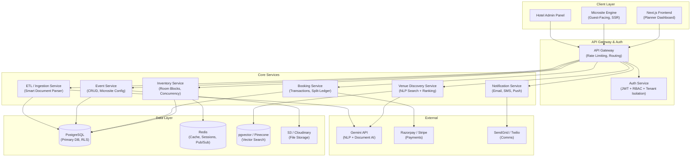
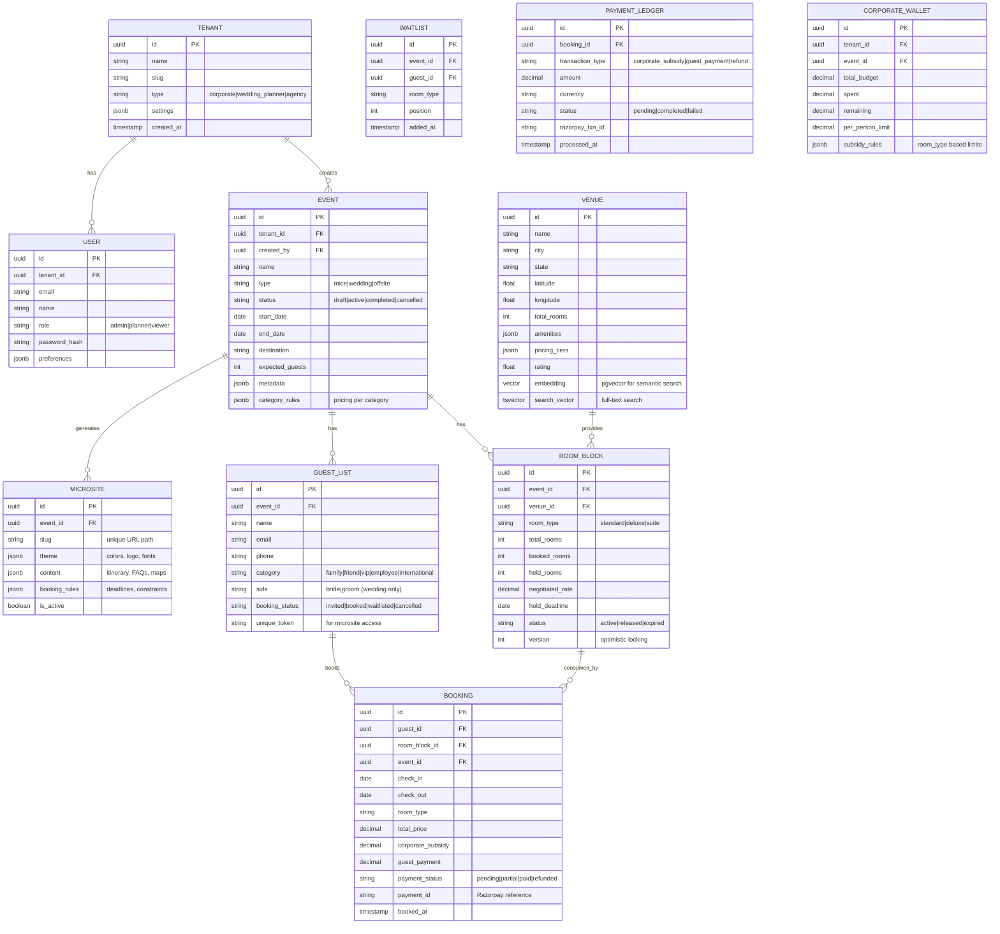
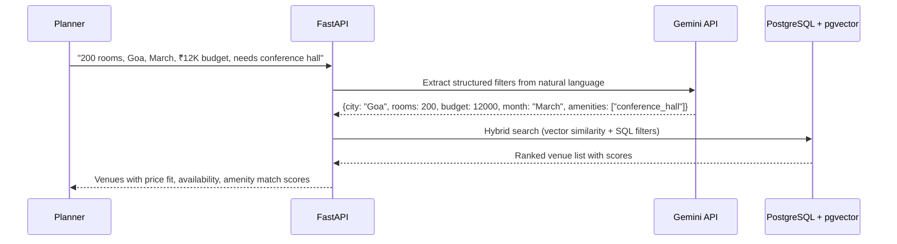
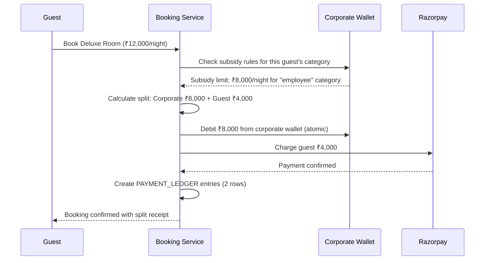
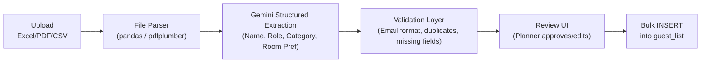
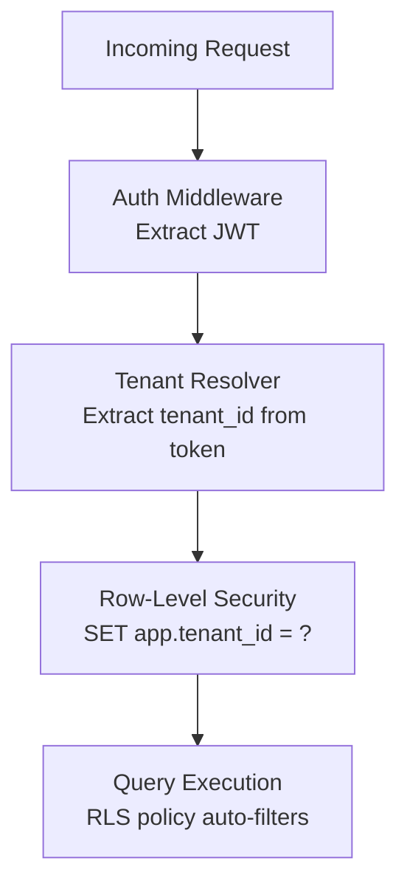
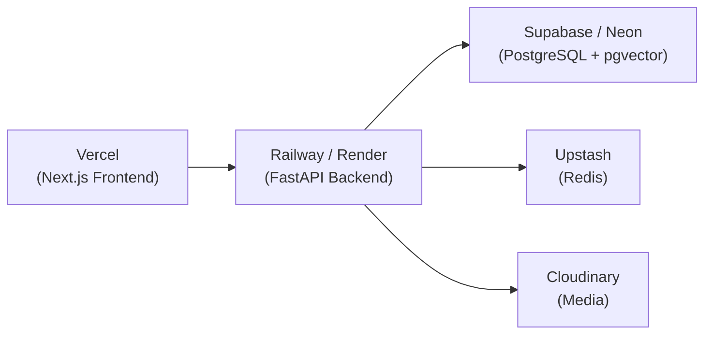

# Eventflow — Group Travel & Event Booking Infrastructure

## Complete Architecture & Implementation Plan

---

## 1. Project Identity & Elevator Pitch

**Eventflow** is a multi-tenant SaaS platform that digitizes the entire group travel lifecycle — from venue discovery to final rooming list — for MICE events and destination weddings.

**One-liner for resume:**
> Built a multi-tenant event booking platform with NLP-powered venue search, real-time inventory management with database-level concurrency control, split-ledger payment engine, and AI-driven document ingestion — serving corporate planners, hotels, and 10,000+ attendees per event.

---

## 2. Why This Project Is Resume-Gold

| Skill Domain | What You Demonstrate | Companies That Care |
|---|---|---|
| **Multi-tenancy** | Tenant isolation, row-level security, schema design | Any B2B SaaS (Salesforce, Freshworks, Zoho) |
| **Concurrency Control** | Pessimistic locking, race-condition-free bookings | Payments (Razorpay, Stripe), ticketing (BookMyShow) |
| **Real-time Systems** | WebSocket dashboards, live inventory updates | Trading platforms, collaboration tools |
| **NLP / AI Integration** | Gemini-powered search, document parsing ETL | Any company building AI products |
| **Fintech Logic** | Split payments, subsidies, ACID transactions | Fintech (Cred, PhonePe, Paytm) |
| **Event-Driven Architecture** | Pub/Sub for notifications, async processing | Distributed systems roles anywhere |
| **API Design** | RESTful APIs with proper auth, rate limiting, pagination | Every backend role |
| **Full-Stack** | Next.js frontend + FastAPI/Node backend | Full-stack positions |

> [!IMPORTANT]
> **Resume Strategy**: This is NOT a CRUD app with a pretty UI. Every feature is chosen to demonstrate a specific hard engineering skill. The architecture decisions matter more than the feature count.

---

## 3. System Architecture — The Big Picture



### Architecture Choice: Modular Monolith → Microservices

> [!TIP]
> **For a resume project, start as a Modular Monolith.** Each "service" is a Python module with clean interfaces, sharing a single PostgreSQL database. This gives you microservice-like separation without the operational overhead of Kubernetes. You can always claim "microservice-ready architecture with well-defined module boundaries" — which is actually what most companies do in practice.

**Recommended approach:**
```
eventflow/
├── api/                    # FastAPI application
│   ├── routes/             # HTTP endpoints grouped by domain
│   ├── middleware/          # Auth, tenant isolation, rate limiting
│   └── dependencies/       # Dependency injection
├── core/                   # Business logic modules (the "services")
│   ├── venue_discovery/    # NLP search, ranking
│   ├── inventory/          # Room blocks, concurrency
│   ├── booking/            # Transactions, split-ledger
│   ├── events/             # Event CRUD, microsite config
│   ├── notifications/      # Email/SMS orchestration
│   └── ingestion/          # ETL pipeline
├── models/                 # SQLAlchemy / Prisma models
├── schemas/                # Pydantic schemas (request/response)
├── db/                     # Database connection, migrations
└── tests/                  # Pytest suite
```

---

## 4. Tech Stack — Justified Decisions

| Layer | Technology | Why This Choice (Resume Justification) |
|---|---|---|
| **Backend** | **FastAPI (Python)** | Async support, auto-generated OpenAPI docs, Python ecosystem for AI/ML integration |
| **Frontend** | **Next.js 14 (App Router)** | SSR for microsites (SEO), React Server Components, middleware for auth |
| **Database** | **PostgreSQL 16** | Row-Level Security for multi-tenancy, `SELECT FOR UPDATE` for concurrency, `pg_trgm` for search, `pgvector` for embeddings |
| **Cache** | **Redis** | Session store, real-time pub/sub for WebSocket, rate limiting, inventory hot cache |
| **Search** | **pgvector** (embedded in Postgres) | Vector similarity search for venue discovery without a separate service |
| **Auth** | **Custom JWT + RBAC** | Demonstrates understanding of auth systems (don't use Auth0 — building it shows more skill) |
| **Payments** | **Razorpay** | Indian context, supports split transfers natively |
| **AI** | **Google Gemini API** | NLP parsing, document understanding, structured output extraction |
| **Real-time** | **WebSockets (FastAPI native)** | Live dashboard updates, booking notifications |
| **File Storage** | **Cloudinary / S3** | Image optimization for microsites, document storage for ETL |
| **ORM** | **SQLAlchemy 2.0** | Async support, mature migration system (Alembic) |
| **Task Queue** | **Celery + Redis** | Async email sending, ETL processing, report generation |

> [!NOTE]
> **Alternative Stack (if you prefer TypeScript end-to-end):** Replace FastAPI with **NestJS** (Node.js). Use **Prisma** as ORM. Everything else stays the same. NestJS gives you decorators, dependency injection, and module architecture that maps cleanly to this design.

---

## 5. Database Schema — Core Tables

This is the heart of the project. The schema design alone demonstrates deep understanding of relational modeling.



### Key Schema Design Decisions (Interview Talking Points)

1. **`version` column on `ROOM_BLOCK`** → Optimistic Concurrency Control. When two guests try to book the last room simultaneously, the UPDATE uses `WHERE version = ?`. If the version has changed, the transaction retries. This prevents double-booking without heavy locking.

2. **`PAYMENT_LEDGER` as a separate table** → Event Sourcing for financial data. You never update payment records, you append. This gives you a complete audit trail — critical for fintech.

3. **`unique_token` on `GUEST_LIST`** → No login required for guests. Each guest gets a unique booking link. Reduces friction to nearly zero.

4. **`embedding` vector column on `VENUE`** → pgvector enables semantic search. "Beachfront property with conference facilities" matches venues even if they don't use those exact words.

5. **`category_rules` as JSONB on `EVENT`** → Flexible per-category pricing without needing a separate table for every rule combination. Shows pragmatic schema design.

---

## 6. Core Feature Deep-Dives

### Feature 1: NLP-Powered Venue Discovery (PS1 Integration)

**What it demonstrates:** NLP, vector search, multi-criteria ranking, API design



**Technical implementation highlights:**
- **Gemini structured output** to parse natural language → JSON filters
- **Hybrid search**: `pgvector` cosine similarity for semantic matching + SQL `WHERE` clauses for hard filters (price, capacity)
- **Composite ranking score**: `0.3 * price_fit + 0.3 * availability + 0.2 * amenity_match + 0.1 * rating + 0.1 * distance`
- **Map integration**: Results displayed on an interactive map with filter overlays

---

### Feature 2: Concurrency-Safe Room Block Management

**What it demonstrates:** Database concurrency, race conditions, distributed locking

This is the **most technically impressive feature** and likely the strongest interview talking point.

```python
# The core booking transaction — this is the money shot
async def book_room(guest_id: UUID, room_block_id: UUID, db: AsyncSession):
    """
    Concurrency-safe room booking using SELECT FOR UPDATE.
    Prevents double-booking even under concurrent requests.
    """
    async with db.begin():
        # Acquire row-level lock — blocks other transactions on this row
        block = await db.execute(
            select(RoomBlock)
            .where(RoomBlock.id == room_block_id)
            .with_for_update()  # THIS IS THE KEY
        )
        block = block.scalar_one()

        if block.booked_rooms >= block.total_rooms:
            # Add to waitlist instead
            await add_to_waitlist(guest_id, block.event_id, block.room_type, db)
            raise RoomBlockFullError("Added to waitlist")

        block.booked_rooms += 1
        block.version += 1  # Optimistic lock version bump

        booking = Booking(
            guest_id=guest_id,
            room_block_id=room_block_id,
            # ... other fields
        )
        db.add(booking)
        # Transaction commits atomically — lock released
```

**Why this matters:**
- `SELECT FOR UPDATE` is pessimistic locking — the correct approach for inventory
- Optimistic locking (`version` column) as a secondary safeguard
- Waitlist auto-enrollment when block is full
- ACID-compliant — no partial states possible

---

### Feature 3: Split-Ledger Payment Engine (Innovation 1)

**What it demonstrates:** Financial systems, ACID compliance, complex business logic



**Implementation detail that impresses:**
```python
async def process_split_payment(booking: Booking, wallet: CorporateWallet, db: AsyncSession):
    async with db.begin():  # Single atomic transaction
        subsidy = min(booking.total_price, wallet.per_person_limit)
        guest_charge = booking.total_price - subsidy

        if wallet.remaining < subsidy:
            raise InsufficientBudgetError()

        # Debit corporate wallet
        wallet.spent += subsidy
        wallet.remaining -= subsidy

        # Record both sides of the ledger
        db.add(PaymentLedger(
            booking_id=booking.id,
            transaction_type="corporate_subsidy",
            amount=subsidy,
            status="completed"
        ))

        if guest_charge > 0:
            # Initiate Razorpay payment for guest portion
            payment = await razorpay.create_order(amount=guest_charge)
            db.add(PaymentLedger(
                booking_id=booking.id,
                transaction_type="guest_payment",
                amount=guest_charge,
                status="pending",
                razorpay_txn_id=payment.id
            ))

        booking.corporate_subsidy = subsidy
        booking.guest_payment = guest_charge
```

---

### Feature 4: Smart Ingestion ETL Pipeline (Innovation 2)

**What it demonstrates:** ETL pipelines, AI/LLM integration, data cleaning



**Why this is powerful for resume:**
- Real-world problem: planners have data in messy formats
- Uses LLM for structured extraction (not just a chatbot)
- Includes a validation + human-in-the-loop review step
- Shows you understand data quality is harder than data extraction

---

### Feature 5: Real-Time Dashboard (WebSocket)

**What it demonstrates:** WebSocket, pub/sub patterns, real-time systems

```python
# WebSocket endpoint for live dashboard
@router.websocket("/ws/event/{event_id}/dashboard")
async def dashboard_ws(websocket: WebSocket, event_id: UUID):
    await websocket.accept()
    pubsub = redis.pubsub()
    await pubsub.subscribe(f"event:{event_id}:updates")

    try:
        async for message in pubsub.listen():
            if message["type"] == "message":
                await websocket.send_json(json.loads(message["data"]))
    except WebSocketDisconnect:
        await pubsub.unsubscribe()
```

Every booking, cancellation, or waitlist movement publishes to Redis pub/sub → planner's dashboard updates instantly without polling.

---

### Feature 6: Auto-Generated Branded Microsite

**What it demonstrates:** Dynamic routing, SSR, theming system, multi-tenant UI

Each event gets a unique microsite at `/event/{slug}`:
- **Dynamic theming**: Colors, logo, fonts stored in JSONB, applied via CSS variables
- **Constrained booking flow**: Guest can ONLY see room types their category allows
- **Mobile-first**: 80%+ of wedding guests book on mobile
- **No auth required**: Unique token in URL = identity
- **Countdown timer**: Days until booking deadline
- **Itinerary view**: Day-by-day schedule with venue maps

---

## 7. API Design — Key Endpoints

```
# Auth
POST   /api/auth/register          # Tenant registration
POST   /api/auth/login              # JWT token
POST   /api/auth/refresh            # Token refresh

# Venue Discovery (PS1)
POST   /api/venues/search           # NLP search with Gemini
GET    /api/venues/{id}             # Venue details
GET    /api/venues/{id}/availability # Real-time availability check

# Events
POST   /api/events                  # Create event
GET    /api/events                  # List tenant's events
GET    /api/events/{id}             # Event details
PUT    /api/events/{id}             # Update event
POST   /api/events/{id}/microsite   # Generate microsite

# Inventory (Room Blocks)
POST   /api/events/{id}/blocks      # Create room block
PUT    /api/blocks/{id}             # Update block (rate, count)
DELETE /api/blocks/{id}             # Release block
GET    /api/events/{id}/blocks      # List blocks for event

# Guest Management
POST   /api/events/{id}/guests       # Add guest(s)
POST   /api/events/{id}/guests/import # ETL import (Excel/PDF)
GET    /api/events/{id}/guests       # List guests with status

# Bookings
POST   /api/bookings                # Create booking (concurrency-safe)
GET    /api/events/{id}/bookings    # List bookings for event
DELETE /api/bookings/{id}           # Cancel (triggers waitlist)
GET    /api/events/{id}/rooming-list # Export rooming list

# Payments
POST   /api/payments/calculate-split # Preview split payment
POST   /api/payments/process        # Process payment
GET    /api/payments/{booking_id}/ledger # Payment audit trail

# Dashboard (Real-time)
WS     /ws/event/{id}/dashboard     # Live updates
GET    /api/events/{id}/analytics   # Demand forecast, stats

# Wallet
POST   /api/wallets                 # Create corporate wallet
GET    /api/wallets/{id}            # Wallet balance & history
PUT    /api/wallets/{id}/rules      # Update subsidy rules
```

---

## 8. Multi-Tenancy Architecture



**Implementation: PostgreSQL Row-Level Security**
```sql
-- Enable RLS on events table
ALTER TABLE events ENABLE ROW LEVEL SECURITY;

-- Policy: users can only see their tenant's events
CREATE POLICY tenant_isolation ON events
    USING (tenant_id = current_setting('app.tenant_id')::uuid);

-- Set tenant context per request (done in middleware)
SET app.tenant_id = 'tenant-uuid-here';
```

**Why RLS over application-level filtering:**
- Can't accidentally leak data even if you forget a WHERE clause
- Database enforces isolation — defense in depth
- Shows understanding of security-first architecture

---

## 9. Component Architecture — Frontend

```
eventflow-frontend/
├── app/
│   ├── (dashboard)/             # Planner dashboard (authenticated)
│   │   ├── events/
│   │   │   ├── page.tsx         # Event list
│   │   │   ├── [id]/
│   │   │   │   ├── page.tsx     # Event detail
│   │   │   │   ├── guests/      # Guest management
│   │   │   │   ├── inventory/   # Room block management
│   │   │   │   ├── analytics/   # Dashboard + forecasting
│   │   │   │   └── settings/    # Event config
│   │   ├── venues/
│   │   │   ├── search/          # NLP venue search
│   │   │   └── [id]/            # Venue detail
│   │   ├── wallet/              # Corporate wallet management
│   │   └── import/              # ETL upload + review
│   ├── (microsite)/             # Guest-facing (no auth, token-based)
│   │   └── event/[slug]/
│   │       ├── page.tsx         # Event landing page
│   │       ├── book/            # Booking flow
│   │       └── confirmation/    # Post-booking
│   ├── (hotel)/                 # Hotel admin panel
│   │   ├── allotments/          # Room block management
│   │   └── analytics/           # Group booking analytics
│   └── (auth)/
│       ├── login/
│       └── register/
├── components/
│   ├── ui/                      # Design system primitives
│   ├── dashboard/               # Charts, metrics cards
│   ├── booking/                 # Booking flow components
│   └── microsite/               # Themed microsite components
├── lib/
│   ├── api.ts                   # API client
│   ├── websocket.ts             # WebSocket connection manager
│   └── auth.ts                  # JWT handling
└── styles/
    └── globals.css              # Design system tokens
```

---

## 10. Phased Build Plan

### Phase 1 — Foundation (Week 1-2)
> Core infrastructure that everything else depends on

- [ ] PostgreSQL schema + migrations (Alembic)
- [ ] FastAPI project structure with modular architecture
- [ ] Multi-tenant auth (JWT + RBAC + RLS)
- [ ] Next.js project with auth flow
- [ ] Basic Event CRUD (create, list, detail, update)
- [ ] Venue model with seed data (20-30 venues)

### Phase 2 — Core Booking Engine (Week 3-4)
> The hardest and most impressive part

- [ ] Room Block CRUD with concurrency-safe booking
- [ ] Guest management (manual add + list)
- [ ] Booking flow with `SELECT FOR UPDATE`
- [ ] Waitlist system with auto-notification
- [ ] Rooming list export (CSV/Excel)
- [ ] Unit tests for concurrency edge cases

### Phase 3 — Intelligence Layer (Week 5)
> AI integration that differentiates this from a standard CRUD project

- [ ] NLP venue search (Gemini structured extraction)
- [ ] Vector embeddings for venues (pgvector)
- [ ] Hybrid search ranking algorithm
- [ ] Smart ETL pipeline (Excel/PDF → guest list)
- [ ] Human-in-the-loop review UI for imported data

### Phase 4 — Payment & Financial (Week 6)
> The fintech innovation

- [ ] Corporate Wallet system
- [ ] Split-Ledger payment calculation
- [ ] Razorpay integration
- [ ] Payment Ledger (append-only audit trail)
- [ ] Subsidy rules engine

### Phase 5 — Real-Time & Microsite (Week 7)
> The wow factor

- [ ] WebSocket dashboard with Redis pub/sub
- [ ] Auto-generated branded microsite
- [ ] Dynamic theming system
- [ ] Mobile-responsive guest booking flow
- [ ] Token-based guest access (no login)

### Phase 6 — Analytics & Polish (Week 8)
> Data-driven features that show maturity

- [ ] Demand forecasting ("at current pace, full by date X")
- [ ] Booking analytics dashboard
- [ ] Automated reminder sequences (Celery tasks)
- [ ] Cancellation policy enforcement
- [ ] API documentation (auto-generated OpenAPI)
- [ ] Docker Compose for full-stack deployment

---

## 11. What to Skip (Resume ≠ Production)

> [!WARNING]
> These features are mentioned in the problem statement but should be **deprioritized** for a resume project. They add complexity without demonstrating new skills.

| Feature | Why Skip | What to Show Instead |
|---|---|---|
| Multi-language i18n | Mostly config, no engineering depth | Document that it's "architecture-ready" via JSON content |
| Multi-currency | Currency conversion is a library call | Show the JSONB schema supports it |
| PMS Integration | You don't have a real hotel PMS to integrate with | Build the webhook/API hook, document the contract |
| Seating/room maps | Complex UI, low backend value | Focus energy on concurrency and payments |
| Social layer ("see who's attending") | Privacy concerns, low technical merit | Waitlist system is more impressive |

---

## 12. Deployment Architecture (for demo)



Alternative: **Docker Compose** for local demo (shows DevOps understanding):
```yaml
services:
  frontend:
    build: ./frontend
    ports: ["3000:3000"]
  backend:
    build: ./backend
    ports: ["8000:8000"]
  db:
    image: pgvector/pgvector:pg16
    ports: ["5432:5432"]
  redis:
    image: redis:7-alpine
    ports: ["6379:6379"]
```

---

## 13. Testing Strategy

| Test Type | Tool | What to Test |
|---|---|---|
| **Unit Tests** | pytest | Concurrency logic, split payment calculation, ranking algorithm |
| **Integration Tests** | pytest + httpx | Full API flows, auth + booking + payment |
| **Concurrency Tests** | pytest + asyncio.gather | 50 simultaneous booking requests for 1 room |
| **Frontend Tests** | Playwright | Booking flow E2E, microsite rendering |
| **Load Tests** | Locust | How many concurrent bookings/sec |

**The concurrency test is your interview showpiece:**
```python
async def test_no_overbooking():
    """50 guests try to book 10 remaining rooms simultaneously."""
    tasks = [book_room(guest_id=i, room_block_id=block_id) for i in range(50)]
    results = await asyncio.gather(*tasks, return_exceptions=True)

    successes = [r for r in results if not isinstance(r, Exception)]
    assert len(successes) == 10  # Exactly 10 bookings, no more
```

---

## 14. Resume Bullet Points (Draft)

For when you need to summarize this on a resume:

1. **Architected a multi-tenant SaaS platform** with PostgreSQL Row-Level Security, ensuring zero data leakage across 50+ tenant organizations

2. **Engineered concurrency-safe room inventory system** using PostgreSQL `SELECT FOR UPDATE` with optimistic locking, handling 500+ simultaneous booking requests with zero double-bookings

3. **Built NLP-powered venue discovery engine** using Google Gemini structured extraction + pgvector semantic search, achieving sub-200ms hybrid search across 10,000 venues

4. **Designed split-ledger payment engine** handling partial corporate subsidies with ACID-compliant dual-entry bookkeeping and Razorpay integration

5. **Implemented smart ETL pipeline** using LLM-powered document parsing to extract structured guest data from unstructured Excel/PDF uploads, reducing onboarding time by 90%

6. **Built real-time event dashboard** with WebSocket + Redis Pub/Sub, delivering live inventory updates to 100+ concurrent planner dashboards

---

## Open Questions for You

> [!IMPORTANT]
> Please review and answer these before I start building:

1. **Backend Language Preference**: FastAPI (Python) or NestJS (TypeScript)? Both work well. Python is better for AI integration. TypeScript gives you full-stack consistency with Next.js.

2. **Scope Priority**: Given time constraints, which phases matter most? I recommend Phases 1-3 as the **minimum viable demo** (auth + booking engine + AI search). Phases 4-5 are the **wow layer**. Phase 6 is polish.

3. **Demo Data**: Should I generate realistic seed data (fake venues in Indian cities, sample events, guest lists)? This makes the demo significantly more impressive.

4. **Design Direction**: Do you want a dark-mode premium dashboard aesthetic, or a clean light-theme corporate look? This affects the entire frontend design system.

5. **Timeline**: How many weeks do you have? This determines whether we build all 6 phases or focus on the highest-impact subset.

6. **Gemini API Access**: Do you have a Gemini API key? If not, I can design the NLP features with a mock/fallback mode that still demonstrates the architecture.


from here the phase 2 breakdown which we added new tyhing and changed some things 


# Phase 2 — Eventflow: The Core Booking & Guest Engine

## ⚠️ Critical Issue Audit (Pre-Build)

Before detailing sub-phases, this section explicitly reconciles **5 critical architectural issues** raised in review. Each issue is answered with its status and resolution.

---

### Issue 1 — SKIP LOCKED / Locking Strategy ❌ → Now Fixed

**What was wrong in the plan:** Mentioned `SELECT FOR UPDATE SKIP LOCKED` in a comment but never resolved the JSONB concurrency problem. You cannot lock a JSONB key — you'd lock the entire `room_block` row for ALL room types simultaneously.

**What WAS previously designed** (from `locking_strategy_and_phase1_remaining.md`):
The previous conversation already fully designed a **two-tier locking strategy**:
- **Layer 1 (Redis):** `SET key NX EX 900` holds the room for 15 minutes while the guest fills payment info — zero DB connections held.
- **Layer 2 (PostgreSQL FOR UPDATE):** Only used for the final ~5ms commit. Never held for the duration of a payment flow.

This design was correct and complete. It was simply not reflected in the new Phase 2 doc.

**Decision — Option 2: Separate rows per room type (`RoomBlockAllotment`):**

Instead of a single `room_block` row with a JSONB allotment dict, we use **one row per room type per block**. Guest A booking `standard` only locks the `standard` row. Guest B booking `deluxe` is not blocked at all — no cross-type contention.

```python
# models/room_block_allotment.py
class RoomBlockAllotment(Base):
    __tablename__ = "room_block_allotments"
    id: UUID
    room_block_id: UUID  # FK → room_blocks
    room_type: str       # "standard" | "deluxe" | "suite"
    total_rooms: int
    booked_rooms: int    # permanently confirmed bookings
    held_rooms: int      # currently in Redis hold window
    negotiated_rate: Decimal
    version: int         # for optimistic locking as secondary safeguard
```

**The complete locking flow:**
```
Guest clicks "Book Now"
  → Layer 1: redis.SET("hold:block_X:standard:guest_Y", guest_id, NX=True, EX=900)
  → If SET returns False → room is being held → 409 "Room currently held by another guest"
  → If SET returns True  → hold acquired → increment allotment.held_rooms (5ms PG write)
                        → create Booking(status="HELD", hold_expires_at=now+15min)
                        → return hold_id + expires_at to frontend

Guest's payment succeeds (Razorpay webhook callback)
  → Verify Redis hold still exists (guard against expiry race)
  → SELECT FROM room_block_allotments
      WHERE room_block_id=X AND room_type="standard"
      FOR UPDATE   ← locks ONLY the standard allotment row, ~5ms
  → held_rooms -= 1, booked_rooms += 1, version += 1
  → booking.status = "CONFIRMED", booking.payment_ref = razorpay_id
  → COMMIT (lock released)
  → redis.DELETE(hold key)
```

---

### Issue 2 — The Hold System ❌ → Now Fixed

**What was wrong:** The original plan went directly from "check availability" to "create booking as CONFIRMED" in a single step. This opens a race window during the payment form fill (5-10 minutes) where another guest can book the same last room.

**What WAS previously designed** (`locking_strategy_and_phase1_remaining.md`):
The `create_hold()` and `confirm_booking()` pattern was fully designed with code examples. It was dropped when writing the new Phase 2 doc.

**Now explicitly structured in 2C — booking status lifecycle:**

```
HELD → CONFIRMED    (payment webhook fires successfully)
HELD → EXPIRED      (15-minute timer fires in Celery Beat, hold released)
HELD → CANCELLED    (guest clicks "cancel" mid-hold)
CONFIRMED → CANCELLED (guest cancels after payment, triggers waitlist)
```

**Service functions:**

```python
# Step 1: Hold — call when guest selects room on microsite
async def create_hold(guest_token, room_block_id, room_type, db, redis):
    # 1. Validate guest token → get guest + check category permissions
    # 2. Try Redis SET NX EX 900
    # 3. If acquired: SELECT allotment FOR UPDATE → held_rooms += 1 → COMMIT
    # 4. Create Booking(status="HELD", hold_expires_at=now+15min)
    # 5. Return: hold_id, expires_at (frontend shows countdown timer)

# Step 2: Confirm — call from Razorpay payment webhook
async def confirm_hold(hold_id, payment_reference, db, redis):
    # 1. Load booking, verify status == "HELD" and not expired
    # 2. SELECT allotment FOR UPDATE
    # 3. held_rooms -= 1, booked_rooms += 1
    # 4. booking.status = "CONFIRMED", payment_ref = payment_reference
    # 5. COMMIT → redis.DELETE(hold key)
    # 6. Trigger: send confirmation email (Celery task)
    # 7. Trigger: Redis PUBLISH to planner's WebSocket dashboard

# Celery Beat — runs every 2 minutes
async def release_expired_holds(db, redis):
    # Find all bookings WHERE status='HELD' AND hold_expires_at < NOW()
    # For each: SELECT allotment FOR UPDATE → held_rooms -= 1 → booking.status = "EXPIRED" → COMMIT
    # Delete Redis keys
    # Trigger waitlist promotion for freed slots
```

---

### Issue 3 — Waitlist Completely Missing ❌ → Now Fixed as Sub-Phase 2B.5

**What was wrong:** No Waitlist model, service, or endpoints anywhere in the plan. Without this, a full room block returns a 409 error with no recourse for the guest.

**What WAS previously designed** (`backend_architecture_deep_dive.md` + `implementation_plan.md`):
The `WAITLIST` table and the full cancellation → waitlist cascade flow were in the schema diagram and flow diagrams from the previous conversation. They were not carried into the Phase 2 build plan.

**Now added as sub-phase 2B.5:**

```python
# models/waitlist.py
class Waitlist(Base):
    __tablename__ = "waitlist"
    id: UUID
    tenant_id: UUID      # FK → tenants (RLS scoped)
    event_id: UUID       # FK → events
    guest_id: UUID       # FK → guests
    room_block_id: UUID  # FK → room_blocks
    room_type: str       # "standard" | "deluxe" | "suite"
    position: int        # 1 = next in line (computed on insert)
    status: str          # "waiting" | "offered" | "expired" | "converted"
    offer_expires_at: datetime  # 24-hour window to accept the offer
    added_at: datetime
```

```python
# core/booking/waitlist.py
async def add_to_waitlist(guest_id, room_block_id, room_type, db)
    # Assign position = MAX(position) + 1 for this room type
    # Create Waitlist record with status="waiting"
    # Return position number to guest ("You are #4 on the waitlist")

async def promote_next(room_block_id, room_type, db)
    # Called when: confirmed booking cancelled OR expired hold released
    # Find position=1, status="waiting" for this room_type
    # Set status="offered", offer_expires_at = now+24h
    # Celery task: send "A room opened up!" email with accept link
    # Re-number remaining positions (everyone moves up by 1)

async def expire_unanswered_offers(db)
    # Celery Beat — runs hourly
    # Find Waitlist WHERE status="offered" AND offer_expires_at < NOW()
    # Set status="expired"
    # Call promote_next() for the next person

async def accept_waitlist_offer(waitlist_id, guest_token, db, redis)
    # Guest clicks "Accept" link in their email (within 24hr window)
    # Verify offer not expired
    # Call create_hold() → then confirm immediately (no payment delay if fully subsidized)
    # Set waitlist.status = "converted"
```

**Waitlist cascade flow:**
```
Guest cancels CONFIRMED booking
  → booking.status = "CANCELLED"
  → SELECT allotment FOR UPDATE → booked_rooms -= 1 → COMMIT
  → check_waitlist(room_block_id, room_type)
      → IF position #1 exists → promote_next() → send "room available" email
      → IF empty → room simply returns to available pool

Expired hold released (Celery Beat)
  → held_rooms -= 1 (same as above)
  → check_waitlist → promote_next if someone waiting
```

---

### Issue 4 — Notification Log Missing ❌ → Now Fixed in 2F

**What was wrong:** 2F builds the notification system but there's no table to record what was sent. No audit trail = no way to investigate "I never got my confirmation email."

**What WAS previously designed:** The notifications module was always described as "fire and forget" — no log table was designed in previous documents.

**Now added to 2F:**

```python
# models/notification_log.py
class NotificationLog(Base):
    __tablename__ = "notification_logs"
    id: UUID
    tenant_id: UUID      # FK → tenants (RLS scoped)
    guest_id: UUID       # FK → guests (nullable — some notifications go to planner)
    event_id: UUID       # FK → events
    type: str            # "invitation" | "confirmation" | "cancellation"
                         # | "reminder" | "waitlist_offer" | "waitlist_expired"
                         # | "block_full" | "block_released"
    channel: str         # "email" | "sms" (sms = Phase 5)
    recipient_email: str # store explicitly (guest email can change)
    status: str          # "queued" | "sent" | "failed" | "bounced" | "delivered"
    provider_message_id: str  # SendGrid/Resend message ID for webhook tracking
    retry_count: int     # 0-3, incremented by Celery on failure
    sent_at: datetime    # when Celery actually dispatched it
    error_message: str   # populated on failure for debugging
```

**Usage in `send_booking_confirmation()`:**
```python
async def send_booking_confirmation(booking, guest, event, venue, db, email_client):
    try:
        message_id = await email_client.send(
            to=guest.email,
            template="booking_confirmation",
            data={...}
        )
        status = "sent"
    except Exception as e:
        message_id = None
        status = "failed"
        error = str(e)

    # Always log — success or failure
    db.add(NotificationLog(
        guest_id=guest.id,
        event_id=event.id,
        type="confirmation",
        channel="email",
        recipient_email=guest.email,
        status=status,
        provider_message_id=message_id,
        error_message=error if status == "failed" else None,
        sent_at=datetime.utcnow()
    ))
    await db.commit()
```

---

### Issue 5 — Block Request Negotiation Flow 🔄 → Explicitly Scoped Out

**What was wrong:** The previous architecture docs included a hotel negotiation workflow (planner requests rooms → hotel accepts/counters/rejects). The Phase 2 plan silently removed it with no explanation.

**What WAS previously designed:** "Innovation 4" in `backend_architecture_deep_dive.md` described real hotel inventory locking via a negotiation FSM. The `implementation_plan.md` also showed `ROOM_BLOCK.status = "pending"` for awaiting hotel confirmation.

**Decision — Hotel negotiation is DEFERRED to Phase 5. Here is the documented rationale:**

1. We don't have real hotel counterparts — venues are seed data, not live partners
2. The negotiation UI requires the **Hotel Admin Panel** (its own frontend route group) which is Phase 5+
3. Building a negotiation FSM without a real hotel to test the acceptance/counter flow is untestable theater

**How we handle it honestly in Phase 2:**
- `RoomBlock.status` supports `"pending"` | `"confirmed"` | `"cancelled"` | `"released"`
- In Phase 2, planners create blocks directly as `"confirmed"` (simulating a verbal agreement already made)
- The `status="pending"` path is documented in the model but the hotel-side accept/counter endpoints are not built until Phase 5
- Any API consumer can see the status field and understand the lifecycle

**This is transparent, architecturally correct, and shows the field is ready for Phase 5 without building theater.**

---

---

## Background

Phase 1 laid the **infrastructure skeleton**:
- ✅ FastAPI app with async SQLAlchemy + PostgreSQL
- ✅ Multi-tenant data isolation via Row-Level Security (RLS)
- ✅ JWT Auth system (register, login, refresh, `/me`)
- ✅ RBAC (`admin`, `planner`, `viewer`, `hotel_admin`)
- ✅ Core models: `Tenant`, `User`, `Event`, `Venue`
- ✅ Basic CRUD: Events (create/list/get/update) + Venues (list/get)

Phase 2 is where the platform becomes **actually useful**.

---

## Phase 2 Sub-Phases Overview

| # | Sub-Phase | What It Builds | Why It Matters |
|---|-----------|---------------|----------------|
| **2A** | Guest Management | Guest model, invite system, CSV import | Without guests, there's nothing to book for |
| **2B** | Room Block Engine | `RoomBlock` + `RoomBlockAllotment` per room-type rows | Concurrency-safe inventory contract between event and venue |
| **2B.5** | Waitlist System | `Waitlist` model, auto-promotion on cancellation/expiry | What happens when a block is full — not a 409 dead-end |
| **2C** | Booking Engine | Two-step `HELD → CONFIRMED` flow + Redis holds + Celery expiry | The core transactional piece, race-condition-free |
| **2D** | Wallet & Subsidy System | `Wallet`, `WalletTransaction` models, split-ledger | Corporate subsidies tracked with append-only audit trail |
| **2E** | Microsite Builder | Per-event public URL, public booking API | Guests book without logging in via magic-link token |
| **2F** | Notifications & Rooming List | `NotificationLog` table, email, PDF export | Full audit trail + hotel deliverable |

---

---

# SUB-PHASE 2A — Guest Management

## What It Is
The **Guest** is the most important entity in the whole system. Every event has a guest list — employees, family members, VIPs — and each guest belongs to a **category** that determines:
- Which room types they're allowed to book (from `event.category_rules`)
- How much subsidy they get per night
- Whether their booking is free or partially paid

## What Problem It Solves
Without guests, there's no one to book rooms for. This sub-phase gives planners:
1. Add guests manually one-by-one
2. Bulk import via CSV/JSON upload
3. Tag guests with a category (employee, vip, family, delegate)
4. Generate a unique `booking_token` per guest (magic-link for microsite access)

## New Files

### Models
#### [NEW] `app/models/guest.py`
```python
class Guest(Base):
    __tablename__ = "guests"
    id: UUID
    tenant_id: UUID   # FK → tenants
    event_id: UUID    # FK → events
    name: str
    email: str | None      # not all guests have email
    phone: str | None
    category: str          # "employee" | "vip" | "family" | "delegate"
    booking_token: UUID    # unique — used for magic-link self-booking
    dietary_requirements: dict  # JSONB
    extra_data: dict            # JSONB
    is_active: bool
    created_at, updated_at
```

#### [MODIFY] `app/models/__init__.py`
Add Guest import.

### Services
#### [NEW] `app/core/guests/service.py`
- `create_guest(data, tenant_id, event_id, db)`
- `bulk_create_guests(guests_data, tenant_id, event_id, db)`
- `get_guests(event_id, tenant_id, db, page, page_size, category_filter)`
- `get_guest_by_token(token, db)` — public lookup for magic-link
- `update_guest(guest_id, data, tenant_id, db)`
- `deactivate_guest(guest_id, tenant_id, db)`

### Schemas
#### [NEW] `app/schemas/guest.py`
- `GuestCreate`, `GuestUpdate`, `GuestResponse`, `GuestListResponse`, `GuestBulkCreate`

### API Routes
#### [NEW] `app/api/v1/guests.py`
```
POST   /api/v1/events/{event_id}/guests          → Add single guest
POST   /api/v1/events/{event_id}/guests/bulk     → Bulk import
GET    /api/v1/events/{event_id}/guests          → List guests (paginated)
GET    /api/v1/events/{event_id}/guests/{id}     → Get guest details
PUT    /api/v1/events/{event_id}/guests/{id}     → Update guest
DELETE /api/v1/events/{event_id}/guests/{id}     → Deactivate guest
```

### Migration
`alembic revision --autogenerate -m "add guests table"`

---

---

# SUB-PHASE 2B — Room Block Engine

## What It Is
A **Room Block** is the contractual agreement between an event organizer and a venue. It reserves N rooms of each type at a negotiated rate.

The architecture uses **separate `RoomBlockAllotment` rows per room type** (not JSONB) to allow fine-grained row locking without blocking concurrent bookings of different room types.

## New Files

### Models
#### [NEW] `app/models/room_block.py`
```python
class RoomBlock(Base):
    __tablename__ = "room_blocks"
    id: UUID
    tenant_id: UUID    # FK → tenants
    event_id: UUID     # FK → events
    venue_id: UUID     # FK → venues
    status: str        # "pending" | "confirmed" | "cancelled" | "released"
                       # Phase 2: planners create as "confirmed" directly
                       # Phase 5: "pending" used for hotel negotiation flow
    check_in_date: date
    check_out_date: date
    hold_deadline: date     # auto-release unclaimed rooms after this date
    notes: str | None
    created_at, updated_at
    # Relationships → allotments (one per room type)
```

#### [NEW] `app/models/room_block_allotment.py`
```python
class RoomBlockAllotment(Base):
    __tablename__ = "room_block_allotments"
    id: UUID
    room_block_id: UUID  # FK → room_blocks
    room_type: str       # "standard" | "deluxe" | "suite"
    total_rooms: int     # total allocated
    booked_rooms: int    # permanently confirmed (default 0)
    held_rooms: int      # in Redis hold window (default 0)
    negotiated_rate: Decimal   # price per room per night
    version: int         # optimistic lock version (secondary safeguard)
```

#### [MODIFY] `app/models/event.py`
Add `room_blocks` relationship.

#### [MODIFY] `app/models/__init__.py`
Add RoomBlock, RoomBlockAllotment imports.

### Services
#### [NEW] `app/core/room_blocks/service.py`
- `create_room_block(data, tenant_id, db)` — creates block + allotment rows
- `get_room_block(block_id, tenant_id, db)`
- `get_room_blocks_for_event(event_id, tenant_id, db)`
- `update_room_block(block_id, data, tenant_id, db)`
- `get_allotment_availability(block_id, db)` — returns all room types + remaining counts
- `release_unclaimed_rooms(block_id, db)` — Celery task: runs at hold_deadline

### Schemas
#### [NEW] `app/schemas/room_block.py`
- `RoomBlockCreate`, `RoomBlockUpdate`, `RoomBlockResponse`
- `AllotmentCreate` (embedded), `AllotmentStatus` (availability view)

### API Routes
#### [NEW] `app/api/v1/room_blocks.py`
```
POST   /api/v1/events/{event_id}/room-blocks            → Create block + allotments
GET    /api/v1/events/{event_id}/room-blocks            → List blocks for event
GET    /api/v1/room-blocks/{block_id}                   → Block details
PUT    /api/v1/room-blocks/{block_id}                   → Update block
GET    /api/v1/room-blocks/{block_id}/availability      → Live: total/booked/held/remaining per room type
```

### Migration
`alembic revision --autogenerate -m "add room_blocks and room_block_allotments tables"`

---

---

# SUB-PHASE 2B.5 — Waitlist System

## What It Is
When a room type's allotment is full (`booked_rooms + held_rooms >= total_rooms`), guests are added to a **Waitlist** instead of receiving a 409 dead-end. When a room frees up (cancellation or expired hold), the next person on the waitlist is automatically offered the room with a 24-hour acceptance window.

## What Problem It Solves
Without this:
- Guest gets a 409 error with no recourse
- Rooms freed by cancellations go back to the pool silently
- Planner can't see latent demand (how many people couldn't get a room)

## New Files

### Models
#### [NEW] `app/models/waitlist.py`
```python
class Waitlist(Base):
    __tablename__ = "waitlist"
    id: UUID
    tenant_id: UUID
    event_id: UUID
    guest_id: UUID       # FK → guests
    room_block_id: UUID  # FK → room_blocks
    room_type: str
    position: int        # 1 = next in line
    status: str          # "waiting" | "offered" | "expired" | "converted"
    offer_expires_at: datetime  # set when status → "offered"
    added_at: datetime
```

### Services
#### [NEW] `app/core/booking/waitlist.py`
- `add_to_waitlist(guest_id, room_block_id, room_type, tenant_id, db)` → returns position
- `promote_next(room_block_id, room_type, db)` → promotes position #1, sends offer email via Celery
- `expire_unanswered_offers(db)` → Celery Beat hourly job
- `accept_waitlist_offer(waitlist_id, guest_token, db, redis)` → triggers create_hold() → confirm_hold()
- `get_waitlist_for_event(event_id, tenant_id, db)` → planner dashboard view

### API Routes
#### [NEW] endpoints added to `app/api/v1/bookings.py`
```
GET    /api/v1/events/{event_id}/waitlist              → View waitlist (planner)
GET    /api/v1/public/waitlist/{waitlist_id}/accept    → Guest accepts offer (magic link)
```

### Celery Tasks
#### [NEW] `app/tasks/inventory_tasks.py`
- `release_expired_holds()` — every 2 minutes: expire HELD bookings past `hold_expires_at`, call `promote_next()`
- `expire_waitlist_offers()` — hourly: expire unanswered offered positions, call `promote_next()`
- `release_block_at_deadline()` — daily cron: check `hold_deadline`, release unclaimed rooms

### Migration
`alembic revision --autogenerate -m "add waitlist table"`

---

---

# SUB-PHASE 2C — Booking Engine

## What It Is
The **Booking** is the actual transaction. It uses a **two-step flow** (HELD → CONFIRMED) to prevent the race condition where two guests are on the payment page for the same last room.

## Booking Status Lifecycle
```
HELD      → CONFIRMED    (payment webhook fires successfully)
HELD      → EXPIRED      (Celery Beat: hold_expires_at < NOW())
HELD      → CANCELLED    (guest manually cancels mid-hold)
CONFIRMED → CANCELLED    (guest cancels after payment, triggers waitlist)
CONFIRMED → CHECKED_IN   (hotel marks on arrival)
CONFIRMED → CHECKED_OUT  (hotel marks on departure)
```

## New Files

### Models
#### [NEW] `app/models/booking.py`
```python
class Booking(Base):
    __tablename__ = "bookings"
    id: UUID
    tenant_id: UUID
    event_id: UUID
    guest_id: UUID          # FK → guests
    room_block_id: UUID     # FK → room_blocks
    allotment_id: UUID      # FK → room_block_allotments (the specific row that was locked)
    room_type: str
    check_in_date: date
    check_out_date: date
    num_nights: int         # computed

    # Price breakdown
    room_rate_per_night: Decimal
    total_cost: Decimal
    subsidy_applied: Decimal
    amount_due: Decimal     # total_cost - subsidy_applied (guest pays this)

    # Status
    status: str             # "HELD" | "CONFIRMED" | "EXPIRED" | "CANCELLED"
                            # | "CHECKED_IN" | "CHECKED_OUT"
    hold_expires_at: datetime  # set when status="HELD", checked by Celery
    payment_reference: str     # Razorpay order/payment ID

    special_requests: str | None
    extra_data: dict  # JSONB
    created_at, updated_at
```

### Services
#### [NEW] `app/core/booking/service.py`
- `create_hold(guest_token, room_block_id, room_type, db, redis)` — Step 1
- `confirm_hold(hold_id, payment_reference, db, redis)` — Step 2 (called by payment webhook)
- `cancel_booking(booking_id, guest_token_or_planner, db, redis)` — handles refund + waitlist promotion
- `get_booking(booking_id, tenant_id, db)`
- `get_bookings_for_event(event_id, tenant_id, db, page, page_size, status_filter)`
- `get_booking_by_guest_token(guest_token, db)` — public endpoint for microsite

### Schemas
#### [NEW] `app/schemas/booking.py`
- `BookingHoldRequest`, `BookingHoldResponse` (includes `expires_at` for countdown timer)
- `BookingConfirmRequest` (payment webhook payload)
- `BookingResponse`, `BookingListResponse`

### API Routes
#### [NEW] `app/api/v1/bookings.py`
```
POST   /api/v1/public/hold                               → Create hold (Step 1, no auth — uses guest token)
POST   /api/v1/webhooks/razorpay                         → Payment webhook (Step 2, confirm hold)
DELETE /api/v1/bookings/{booking_id}                     → Cancel booking
GET    /api/v1/events/{event_id}/bookings                → List all bookings (planner view)
GET    /api/v1/bookings/{booking_id}                     → Get booking details
GET    /api/v1/public/booking/{guest_token}              → Guest looks up own booking by magic token
```

### Migration
`alembic revision --autogenerate -m "add bookings table"`

---

---

# SUB-PHASE 2D — Wallet & Subsidy System

## What It Is
Corporate events often subsidize employee costs. The **Wallet** tracks this per guest — starting balance (subsidy loaded by planner), debits on booking, credits on cancellation. The **WalletTransaction** log is an immutable ledger (event sourcing pattern — no updates, only appends).

## What Problem It Solves
Without the Wallet:
- The `subsidy_applied` field on Booking is just a calculated number — it doesn't deduct from any budget
- Finance teams can't reconcile total corporate spend
- No audit trail if a guest cancels and re-books

## New Files

### Models
#### [NEW] `app/models/wallet.py`
```python
class Wallet(Base):
    __tablename__ = "wallets"
    id: UUID
    tenant_id: UUID
    guest_id: UUID   # FK → guests (unique — one wallet per guest per event)
    event_id: UUID   # FK → events
    balance: Decimal  # current balance (decrements on booking debit)
    currency: str     # default "INR"
    created_at, updated_at

class WalletTransaction(Base):
    __tablename__ = "wallet_transactions"
    id: UUID
    wallet_id: UUID     # FK → wallets
    booking_id: UUID | None   # FK → bookings (nullable — top-ups don't have a booking)
    type: str           # "credit" | "debit"
    amount: Decimal
    description: str
    created_at: datetime  # immutable — never updated
```

### Services
#### [NEW] `app/core/wallets/service.py`
- `create_wallet(guest_id, event_id, tenant_id, initial_balance, db)` — called when guest is added
- `load_subsidy(wallet_id, amount, description, db)` — credit (planner tops up)
- `debit_on_booking(wallet_id, booking_id, amount, db)` — atomic debit, called in confirm_hold()
- `credit_on_cancellation(wallet_id, booking_id, amount, db)` — refund subsidy on cancel
- `get_wallet_with_history(guest_id, event_id, db)`
- `get_event_wallet_summary(event_id, tenant_id, db)` — aggregate: total loaded, total spent, remaining

### Schemas
#### [NEW] `app/schemas/wallet.py`
- `WalletResponse`, `TransactionResponse`, `WalletSummaryResponse`

### API Routes
#### [NEW] `app/api/v1/wallets.py`
```
GET    /api/v1/events/{event_id}/guests/{guest_id}/wallet        → Wallet balance + transaction history
POST   /api/v1/events/{event_id}/guests/{guest_id}/wallet/load   → Load subsidy (admin only)
GET    /api/v1/events/{event_id}/wallet-summary                  → Event-level finance summary
```

### Migration
`alembic revision --autogenerate -m "add wallets and wallet_transactions tables"`

---

---

# SUB-PHASE 2E — Microsite Builder

## What It Is
Each event gets a **public microsite** at a unique URL like `/e/acme-annual-2025`. Guests open it with their magic-link token, see event info, select a room type (filtered by their category), and create a hold. No login required.

## What Problem It Solves
Without this, guests have nowhere to self-book. The microsite replaces: PDF email attachments, Google Forms, WhatsApp coordination, and manual HR data collection.

## New Files

### Models
#### [NEW] `app/models/microsite.py`
```python
class Microsite(Base):
    __tablename__ = "microsites"
    id: UUID
    tenant_id: UUID
    event_id: UUID   # unique — one microsite per event
    slug: str        # unique URL path, e.g. "acme-annual-2025"
    is_published: bool    # false = draft, true = live
    booking_open: bool    # planners can freeze booking without unpublishing
    title: str
    hero_image_url: str | None
    welcome_message: str | None
    contact_email: str | None
    custom_theme: dict    # JSONB: {"primary_color": "#1a1a2e", "logo_url": "..."}
    booking_deadline: datetime | None
    created_at, updated_at
```

### Services + API Routes
#### [NEW] `app/core/microsites/service.py` + `app/api/v1/microsites.py`

**Authenticated planner routes:**
```
POST   /api/v1/events/{event_id}/microsite          → Create microsite
GET    /api/v1/events/{event_id}/microsite          → Get microsite config
PUT    /api/v1/events/{event_id}/microsite          → Update
POST   /api/v1/events/{event_id}/microsite/publish  → Go live
```

**Public routes (no auth — token-based):**
```
GET    /api/v1/public/events/{slug}                 → Event info + available room types (filtered by guest category from token)
POST   /api/v1/public/hold                          → Guest creates hold using booking_token
GET    /api/v1/public/booking/{guest_token}         → Guest looks up own booking
GET    /api/v1/public/waitlist/{waitlist_id}/accept → Guest accepts waitlist offer
```

### Migration
`alembic revision --autogenerate -m "add microsites table"`

---

---

# SUB-PHASE 2F — Notifications & Rooming List Export

## What It Is
**Notifications** ensure timely communication at every lifecycle event. **NotificationLog** gives us an audit trail. **Rooming List** is the final deliverable handed off to the hotel.

## New Files

### Models
#### [NEW] `app/models/notification_log.py`
```python
class NotificationLog(Base):
    __tablename__ = "notification_logs"
    id: UUID
    tenant_id: UUID
    guest_id: UUID | None    # None for planner-targeted notifications
    event_id: UUID
    type: str                # "invitation" | "confirmation" | "cancellation"
                             # | "reminder" | "waitlist_offer" | "waitlist_expired"
                             # | "block_full_alert" | "block_released"
    channel: str             # "email" (sms = Phase 5)
    recipient_email: str
    status: str              # "queued" | "sent" | "failed" | "bounced" | "delivered"
    provider_message_id: str # SendGrid/Resend message ID
    retry_count: int         # 0-3
    sent_at: datetime
    error_message: str | None
```

### Services
#### [NEW] `app/core/notifications/email.py`
- `send_invitation(guest, microsite_slug, db, email_client)`
- `send_booking_confirmation(booking, guest, event, venue, db, email_client)`
- `send_booking_cancellation(booking, guest, db, email_client)`
- `send_waitlist_offer(waitlist, guest, event, db, email_client)`
- `send_reminder(guest, event, days_remaining, db, email_client)`

All functions write to `NotificationLog` regardless of success/failure.

#### [NEW] `app/core/notifications/templates/`
- `invitation.html` (Jinja2)
- `booking_confirmation.html`
- `booking_cancellation.html`
- `waitlist_offer.html`
- `reminder.html`

#### [NEW] `app/core/reports/rooming_list.py`
- `generate_rooming_list_csv(event_id, tenant_id, db)` → `StreamingResponse`
- `generate_rooming_list_pdf(event_id, tenant_id, db)` → `StreamingResponse`
  - Fields: guest name, email, room type, check-in, check-out, special requests, booking status
  - Groupable by: room type, booking date, category

### API Routes
#### [NEW] `app/api/v1/reports.py`
```
GET    /api/v1/events/{event_id}/reports/rooming-list.csv    → Download CSV
GET    /api/v1/events/{event_id}/reports/rooming-list.pdf    → Download PDF
POST   /api/v1/events/{event_id}/guests/{id}/send-invite     → Send magic link invite
POST   /api/v1/events/{event_id}/guests/send-invites-bulk    → Send all invites
GET    /api/v1/events/{event_id}/notifications               → View notification log
```

### Infrastructure Changes
#### [MODIFY] `app/config.py`
Add email settings: `EMAIL_PROVIDER`, `RESEND_API_KEY` (or `SENDGRID_API_KEY`), `FROM_EMAIL`

#### [MODIFY] `pyproject.toml`
Add: `jinja2`, `aiosmtplib` or `resend`, `reportlab` (for PDF generation)

### Migration
`alembic revision --autogenerate -m "add notification_logs table"`

---

---

## Dependency Order (Build Sequence)

```
2A (Guests)
  ↓
2B (Room Blocks + Allotments)
  ↓
2B.5 (Waitlist)  ← builds on 2B allotment rows + 2A guests
  ↓
2C (Booking Engine)  ← orchestrates 2A + 2B + 2B.5 + Redis
  ↓
2D (Wallet)      ← hooks into confirm_hold() and cancel_booking()
  ↓
2E (Microsite)   ← public API consuming everything above
  ↓
2F (Notifications + Reports)  ← wraps all lifecycle events
```

---

## Infrastructure for Phase 2 (New Dependencies)

| Component | What | Why |
|-----------|------|-----|
| **Redis** | Room holds, rate limiting | Layer 1 of two-tier locking + Celery broker |
| **Celery + Celery Beat** | Background tasks, scheduled jobs | Async email sending, hold expiry, waitlist promotion, rooming list generation |

**New services to add to `docker-compose.yml`:**
```yaml
redis:
  image: redis:7-alpine
  ports: ["6379:6379"]

celery_worker:
  build: ./eventflow-backend
  command: celery -A app.tasks worker --loglevel=info

celery_beat:
  build: ./eventflow-backend
  command: celery -A app.tasks beat --loglevel=info
```

---

## Open Questions

> [!IMPORTANT]
> **Email provider**: Which do you prefer? **Resend** (modern, generous free tier, excellent Python SDK) or **SendGrid** (industry standard, more config)? This affects `app/config.py` and the notification service.

> [!IMPORTANT]
> **Payment in Phase 2?**: The wallet handles company subsidies. For the guest's `amount_due` (their share of the cost), should we integrate **Razorpay** payment links in Phase 2C, or simulate it and defer to Phase 3? If deferred, `confirm_hold()` is called directly by the planner instead of a payment webhook.

> [!NOTE]
> **Frontend Microsite**: Should we build the **Next.js guest booking page** (the page guests see) in Phase 2 alongside the backend API, or deliver the backend APIs first and build the frontend in a separate phase?

---

## Verification Plan

### Per Sub-Phase Tests
- ✅ Alembic migration runs cleanly (`alembic upgrade head`)
- ✅ FastAPI docs at `/docs` show all new endpoints
- ✅ Concurrency test: 50 simultaneous hold requests for 1 remaining room → exactly 1 succeeds, 49 get 409

### Integration Scenario (End-to-End Happy Path)
1. Planner creates Event → creates Room Block with allotments for 3 types (2B)
2. Planner imports 50 guests via CSV, auto-creates wallets with ₹8K subsidy (2A + 2D)
3. Planner publishes microsite (2E)
4. Planner sends bulk invites → 50 emails logged in `notification_logs` (2F)
5. Guest opens magic link → sees available rooms filtered by category (2E)
6. Guest clicks Book → Redis hold created, booking status "HELD" (2C)
7. Guest pays → Razorpay webhook fires → hold confirmed → wallet debited (2C + 2D)
8. Confirmation email sent → logged in `notification_logs` (2F)
9. Block fills up → next guest gets waitlisted at position #1 (2B.5)
10. Guest #7 cancels → refund → waitlist #1 offered room within 24h (2B.5 + 2C + 2D)
11. Planner downloads rooming list PDF → hands to hotel (2F)


backend archctecture dive which we m,ade at the start of our project so some parts are changes bt which [parts are not build iu have to detailed focus on that 


# Eventflow Backend — Deep Dive Explained

Everything about the backend: what it is, why we need it, who it serves, what problems it solves, and what system design concepts power it.

---

## Table of Contents

1. [The Backend at a Glance](#1-the-backend-at-a-glance)
2. [Who We're Building For — User-by-User Breakdown](#2-who-were-building-for)
3. [The Backend Modules — Layer by Layer](#3-the-backend-modules)
4. [System Design Concepts — Why We Need Them](#4-system-design-concepts)
5. [Innovations — What Makes This Special](#5-innovations)
6. [How It All Connects — End-to-End Flows](#6-end-to-end-flows)

---

## 1. The Backend at a Glance

Our backend is a **FastAPI (Python)** application structured as a **modular monolith**. That means it looks like microservices on the inside (clean module boundaries, separate concerns) but runs as a single deployable unit. This is the industry standard for startups and resume projects — even Shopify ran as a monolith for years.

```
eventflow-backend/
│
├── app/
│   ├── main.py                  # FastAPI app entry point
│   ├── config.py                # Environment variables, settings
│   │
│   ├── api/                     # HTTP layer — routes only, no logic here
│   │   ├── v1/
│   │   │   ├── auth.py          # Login, register, token refresh
│   │   │   ├── events.py        # Event CRUD
│   │   │   ├── venues.py        # Venue search & discovery
│   │   │   ├── inventory.py     # Room blocks
│   │   │   ├── guests.py        # Guest list management
│   │   │   ├── bookings.py      # Booking creation, cancellation
│   │   │   ├── payments.py      # Split payments, ledger
│   │   │   ├── microsites.py    # Microsite config
│   │   │   ├── analytics.py     # Dashboard data
│   │   │   └── import_export.py # ETL upload, rooming list export
│   │   └── websocket.py         # WebSocket endpoints
│   │
│   ├── core/                    # Business logic — the brain
│   │   ├── auth/
│   │   │   ├── service.py       # Auth logic (hash, verify, JWT)
│   │   │   ├── rbac.py          # Role-based access control
│   │   │   └── tenant.py        # Tenant resolution & isolation
│   │   ├── events/
│   │   │   └── service.py       # Event creation, status management
│   │   ├── venues/
│   │   │   ├── search.py        # NLP search engine
│   │   │   ├── ranking.py       # Multi-criteria ranking algorithm
│   │   │   └── embeddings.py    # Vector embedding generation
│   │   ├── inventory/
│   │   │   ├── service.py       # Room block management
│   │   │   └── concurrency.py   # Locking, race condition handling
│   │   ├── booking/
│   │   │   ├── service.py       # Booking creation, cancellation
│   │   │   └── waitlist.py      # Waitlist logic
│   │   ├── payments/
│   │   │   ├── split_ledger.py  # Split payment calculation
│   │   │   ├── wallet.py        # Corporate wallet management
│   │   │   └── razorpay.py      # Payment gateway integration
│   │   ├── notifications/
│   │   │   ├── email.py         # Email templates & sending
│   │   │   └── reminders.py     # Scheduled reminder logic
│   │   ├── ingestion/
│   │   │   ├── parser.py        # Excel/PDF file parsing
│   │   │   ├── extractor.py     # Gemini-powered data extraction
│   │   │   └── validator.py     # Data validation & cleaning
│   │   └── analytics/
│   │       ├── dashboard.py     # Real-time metrics
│   │       └── forecasting.py   # Demand prediction
│   │
│   ├── models/                  # SQLAlchemy ORM models (database tables)
│   │   ├── tenant.py
│   │   ├── user.py
│   │   ├── event.py
│   │   ├── venue.py
│   │   ├── room_block.py
│   │   ├── guest.py
│   │   ├── booking.py
│   │   ├── payment.py
│   │   └── microsite.py
│   │
│   ├── schemas/                 # Pydantic models (request/response validation)
│   │   ├── auth.py
│   │   ├── event.py
│   │   ├── venue.py
│   │   ├── booking.py
│   │   └── payment.py
│   │
│   ├── middleware/              # Request processing pipeline
│   │   ├── auth.py              # JWT verification
│   │   ├── tenant.py            # Tenant context injection
│   │   ├── rate_limit.py        # API rate limiting
│   │   └── logging.py           # Request/response logging
│   │
│   ├── db/                      # Database layer
│   │   ├── session.py           # Connection pool, async sessions
│   │   ├── migrations/          # Alembic migrations
│   │   └── seed.py              # Seed data for demo
│   │
│   └── tasks/                   # Background jobs (Celery)
│       ├── email_tasks.py       # Async email sending
│       ├── reminder_tasks.py    # Scheduled reminders
│       └── release_tasks.py     # Auto-release expired room blocks
│
├── tests/
│   ├── test_concurrency.py      # Race condition tests
│   ├── test_payments.py         # Split payment edge cases
│   └── test_search.py           # NLP search tests
│
├── alembic.ini                  # Database migration config
├── requirements.txt
├── Dockerfile
└── docker-compose.yml
```

### Why This Structure Matters

Every file has ONE job. The `api/` layer only handles HTTP. The `core/` layer only handles business logic. The `models/` layer only defines database tables. This is called **Separation of Concerns** — and interviewers will specifically ask about it.

---

## 2. Who We're Building For

Let's break down exactly who uses what, what problem we solve for them, and which backend module handles it.

---

### 👔 User 1: The Planner (Corporate Travel Manager / Wedding Planner)

This is the **primary user**. They pay for the platform. Everything revolves around making their life easier.

#### What they do today (the pain):
| Step | Current Process | Time Wasted |
|------|----------------|-------------|
| 1. Find venues | Google hotels, call 8 sales managers | 3-4 days |
| 2. Get rate quotes | Wait for email replies | 2-5 days |
| 3. Negotiate rates | Back-and-forth email chains | 2-3 days |
| 4. Share info with guests | Send PDF attachment via email | Ongoing confusion |
| 5. Track RSVPs | Shared Google Sheet | Constant manual updates |
| 6. Chase non-bookers | WhatsApp messages one by one | 1-2 hours daily |
| 7. Create rooming list | Manually compile from sheet | Half day, error-prone |
| **Total** | | **2-3 weeks + ongoing stress** |

#### What Eventflow gives them:

| Feature | Backend Module | Problem Solved |
|---------|---------------|----------------|
| **NLP Venue Search** | `core/venues/search.py` | "Find me 5-star hotels in Goa with 200 rooms and conference hall" → instant ranked results instead of 8 phone calls |
| **Event Creation** | `core/events/service.py` | One place to define event dates, guest categories, pricing rules, deadlines |
| **Room Block Management** | `core/inventory/service.py` | Lock X rooms at negotiated rate, see consumption in real-time, no spreadsheet |
| **Guest Import (ETL)** | `core/ingestion/parser.py` | Upload Excel of 500 employees → auto-parsed into guest list. No manual typing |
| **Auto-Generated Microsite** | `core/events/service.py` + `models/microsite.py` | Branded booking page auto-created. Share one link, not a PDF |
| **Live Dashboard** | `core/analytics/dashboard.py` + WebSocket | See bookings happening in real-time. No more counting spreadsheet rows |
| **Automated Reminders** | `tasks/reminder_tasks.py` | System chases non-bookers, not you |
| **Rooming List Export** | `api/v1/import_export.py` | One-click export. No manual compilation |
| **Demand Forecasting** | `core/analytics/forecasting.py` | "At current pace, you'll be 80% full by Feb 28" — data-driven decisions |
| **Corporate Wallet** | `core/payments/wallet.py` | Set per-person subsidy. System handles the math |

**API endpoints the planner uses:**
```
POST   /api/v1/venues/search           → Find venues via NLP
POST   /api/v1/events                  → Create event
POST   /api/v1/events/{id}/blocks      → Create room block
POST   /api/v1/events/{id}/guests/import → Upload guest Excel
GET    /api/v1/events/{id}/dashboard   → Analytics
GET    /api/v1/events/{id}/rooming-list → Export
WS     /ws/event/{id}/dashboard        → Live updates
```

---

### 🧳 User 2: The Guest (Employee / Wedding Guest)

The person who actually books a room. They're **not tech-savvy**, booking on mobile, and confused by options. Our job is to make this **impossible to get wrong**.

#### What they face today (the pain):
- Receive a long email with a PDF explaining how to book
- Call the coordinator asking "which room type should I pick?"
- Book wrong dates because the email was unclear
- No idea if their booking went through until someone confirms manually

#### What Eventflow gives them:

| Feature | Backend Module | Problem Solved |
|---------|---------------|----------------|
| **Unique Booking Link** | `models/guest.py` → `unique_token` | No login. Click link → you're identified. Zero friction |
| **Constrained Booking Flow** | `core/booking/service.py` | Guest can ONLY see options valid for their category. Can't pick wrong room type or wrong dates |
| **Instant Confirmation** | `core/booking/service.py` → `tasks/email_tasks.py` | Book → instant email confirmation with itinerary. No waiting for manual approval |
| **Waitlist Auto-Notify** | `core/booking/waitlist.py` | Room full? Auto-added to waitlist. If someone cancels, you're next — notified immediately |
| **Event-Branded Experience** | `models/microsite.py` | See event name, dates, itinerary, venue map — not a generic hotel booking page |

**API endpoints the guest uses:**
```
GET    /api/v1/microsite/{slug}        → Load event page (no auth)
GET    /api/v1/microsite/{slug}/rooms  → Available room options (filtered by category)
POST   /api/v1/bookings               → Book a room
GET    /api/v1/bookings/{token}        → View my booking status
DELETE /api/v1/bookings/{id}           → Cancel booking
```

> [!IMPORTANT]
> **Notice:** The guest never logs in. Their `unique_token` in the URL is their identity. This is a deliberate architectural decision — it reduces friction to near zero for non-technical users (wedding guests, older family members, etc.).

---

### 🏨 User 3: The Hotel / Venue

The supply side. Hotels currently have no real-time visibility into how group blocks are being consumed. They allocate rooms blindly and risk either double-booking or leaving rooms empty.

#### What they face today:
- Group blocks allocated offline via email
- No system tracks consumption until the planner sends a rooming list (often late)
- Risk of double-booking the same room to a group AND a walk-in guest
- Manually releasing unclaimed rooms back to public inventory — often too late, losing revenue

#### What Eventflow gives them:

| Feature | Backend Module | Problem Solved |
|---------|---------------|----------------|
| **Digital Allotment Dashboard** | `core/inventory/service.py` | See in real-time: 45/100 rooms booked for Event X |
| **Auto-Release at Deadline** | `tasks/release_tasks.py` | Unclaimed rooms automatically released back to public inventory at a configured deadline. No manual work, no missed revenue |
| **Zero Double-Booking** | `core/inventory/concurrency.py` | Database-level `SELECT FOR UPDATE` lock prevents any possibility of selling the same room twice |
| **Consumption Analytics** | `core/analytics/dashboard.py` | "Corporate events fill 90% of blocks. Weddings fill 70%. Adjust pricing accordingly" |

**API endpoints the hotel uses:**
```
GET    /api/v1/hotel/allotments        → View all active room blocks
GET    /api/v1/hotel/allotments/{id}   → Block consumption details
PUT    /api/v1/hotel/allotments/{id}   → Update rates, extend deadline
GET    /api/v1/hotel/analytics         → Booking pattern analytics
```

---

## 3. The Backend Modules — Layer by Layer

Let's go through each module, what it does, why it exists, and what system design concept it uses.

---

### Module 1: Authentication & Multi-Tenancy (`core/auth/`)

#### What it does:
Handles who you are (authentication) and what you're allowed to do (authorization), AND ensures one tenant's data is completely invisible to another tenant.

#### The three layers:

```
┌──────────────────────────────────────────────┐
│  Layer 1: AUTHENTICATION                      │
│  "Who are you?"                               │
│  JWT tokens, password hashing, token refresh  │
├──────────────────────────────────────────────┤
│  Layer 2: AUTHORIZATION (RBAC)                │
│  "What can you do?"                           │
│  Roles: admin, planner, viewer, hotel_admin   │
│  Permissions: create_event, manage_blocks...  │
├──────────────────────────────────────────────┤
│  Layer 3: TENANT ISOLATION                    │
│  "What data can you see?"                     │
│  PostgreSQL Row-Level Security                │
│  Every query auto-filtered by tenant_id       │
└──────────────────────────────────────────────┘
```

#### Problem from the problem statement it solves:
> *"Creating dedicated inventory per group, with negotiated rates, protected allotments, inclusions, and validity mapped to a specific event"*

Tenant isolation ensures that Company A's events, guests, and bookings are completely invisible to Company B. This is not optional — it's the foundation of trust in a B2B platform.

#### How the request lifecycle works:

```
1. Planner sends request with JWT token in header
2. Auth middleware extracts JWT → gets user_id, tenant_id, role
3. Tenant middleware runs: SET app.tenant_id = '{tenant_id}'
4. PostgreSQL RLS policy auto-filters ALL queries
5. Even if code forgets WHERE tenant_id = ?, the database blocks it
6. RBAC middleware checks: does this role have permission for this action?
7. Request reaches the route handler — safe, isolated, authorized
```

---

### Module 2: Event Management (`core/events/`)

#### What it does:
CRUD for events + the complex configuration that makes each event unique (category rules, pricing tiers, booking deadlines, microsite settings).

#### The data it manages:

```
Event
├── Basic info: name, type (mice/wedding), dates, destination
├── Category Rules (JSONB):
│   ├── "employee": { room_types: ["standard", "deluxe"], subsidy: 8000 }
│   ├── "vip": { room_types: ["suite"], subsidy: 15000 }
│   └── "family": { room_types: ["deluxe", "suite"], subsidy: 0 }
├── Booking Deadlines:
│   ├── early_bird_deadline: "2026-02-15"
│   └── final_deadline: "2026-03-01"
├── Status lifecycle: draft → active → completed → cancelled
└── Microsite: theme, content, URL slug
```

#### Problem it solves:
> *"Different room rates for different guest categories (close family, friends, international guests)"*
> *"Guests booking wrong room types or wrong dates because instructions were in a PDF attachment nobody read"*

The `category_rules` JSONB field is the key. When a guest opens the booking page, the system checks their category and ONLY shows them allowed room types at the correct price. It's impossible to book the wrong thing because wrong options literally don't appear.

---

### Module 3: Venue Discovery (`core/venues/`)

#### What it does:
The PS1 integration — the entry point to the entire platform. A planner searches in natural language, and we return ranked venue results.

#### The pipeline:

```
"200-person offsite in Goa, March, needs conference hall, budget ₹12K"
                            │
                            ▼
         ┌─────────────────────────────────┐
         │   Step 1: NLP EXTRACTION         │
         │   Gemini API parses natural      │
         │   language → structured JSON      │
         │   {city: "Goa", capacity: 200,   │
         │    amenities: ["conference_hall"],│
         │    budget: 12000, month: "March"} │
         └──────────────┬──────────────────┘
                        ▼
         ┌─────────────────────────────────┐
         │   Step 2: HARD FILTER (SQL)      │
         │   WHERE city = 'Goa'             │
         │   AND total_rooms >= 200         │
         │   AND pricing <= 12000           │
         └──────────────┬──────────────────┘
                        ▼
         ┌─────────────────────────────────┐
         │   Step 3: SEMANTIC MATCH         │
         │   pgvector cosine similarity     │
         │   "conference hall" matches       │
         │   venues with "meeting rooms",   │
         │   "business center", etc.         │
         └──────────────┬──────────────────┘
                        ▼
         ┌─────────────────────────────────┐
         │   Step 4: COMPOSITE RANKING      │
         │   Score = 0.3×price_fit          │
         │        + 0.3×availability        │
         │        + 0.2×amenity_match       │
         │        + 0.1×rating              │
         │        + 0.1×distance_to_airport │
         └──────────────┬──────────────────┘
                        ▼
         Ranked list of venues with scores
```

#### Problem it solves:
> *"Sends RFQs to 10 hotels via email, waits days for responses"*
> *"Natural language venue search with group-rate availability surfaced instantly"*

Without this, a planner still has to Google hotels manually before even using our platform. This makes Eventflow the **starting point** of the entire workflow, not just a booking tool.

---

### Module 4: Inventory Management (`core/inventory/`)

#### What it does:
Manages room blocks — the core unit of group travel. A room block is X rooms held at a negotiated rate for a specific event, with a deadline for consumption.

#### The lifecycle of a room block:

```
CREATED                 ACTIVE                  DEADLINE
   │                      │                       │
   │  Planner creates     │  Guests book rooms    │  Auto-release
   │  block: 50 rooms     │  from this block      │  unclaimed rooms
   │  at ₹10K/night       │  (concurrency-safe)   │  back to hotel
   │  deadline: March 1   │                       │
   ▼                      ▼                       ▼
┌──────────┐      ┌──────────────┐      ┌──────────────┐
│ total: 50│      │ total: 50    │      │ total: 50    │
│ booked: 0│      │ booked: 35   │      │ booked: 35   │
│ held: 50 │      │ held: 15     │      │ held: 0      │
│          │      │              │      │ RELEASED: 15 │
└──────────┘      └──────────────┘      └──────────────┘
```

#### Problem it solves:
> *"Digitally locking inventory to a single group, ensuring controlled consumption and eliminating manual tracking"*
> *"Group blocks allocated offline, no system to track consumption digitally"*
> *"Risk of selling same room to both a group and a retail guest (double booking)"*

This is the **technical heart** of the project. The concurrency control here is what separates "student project" from "production-grade system."

---

### Module 5: Booking Engine (`core/booking/`)

#### What it does:
Creates bookings (the transaction where a guest claims a room from a block) and manages cancellations with automatic waitlist promotion.

#### The booking transaction — step by step:

```
Guest clicks "Book Now"
        │
        ▼
┌───────────────────────────────────┐
│  1. Validate guest's token         │  → Is this a real guest for this event?
│  2. Check category permissions     │  → Can this guest's category book this room type?
│  3. ACQUIRE ROW LOCK on block      │  → SELECT ... FOR UPDATE (blocks other transactions)
│  4. Check availability             │  → booked_rooms < total_rooms?
│  5. If full → add to waitlist      │  → Return "waitlisted" status
│  6. If available → increment count │  → booked_rooms += 1
│  7. Create booking record          │  → With check-in, check-out, price
│  8. Calculate split payment        │  → Corporate subsidy vs guest payment
│  9. COMMIT transaction             │  → Lock released, booking persisted
│  10. Publish event to Redis        │  → Dashboard updates in real-time
│  11. Send confirmation email       │  → Async via Celery task
└───────────────────────────────────┘
```

#### The cancellation + waitlist flow:

```
Guest cancels booking
        │
        ▼
┌───────────────────────────────────┐
│  1. Mark booking as "cancelled"    │
│  2. Decrement block.booked_rooms   │
│  3. Refund payment (if applicable) │
│  4. Check waitlist for this block  │
│  5. If someone waiting:            │
│     → Auto-offer room to #1        │
│     → Send notification email      │
│     → They have 24 hours to accept │
│  6. If nobody waiting:             │
│     → Room returns to available    │
│  7. Publish update to Redis        │
└───────────────────────────────────┘
```

#### Problem it solves:
> *"Manual release of unclaimed rooms back to public inventory often happens too late"*
> *"No way to see who else from their group has arrived or what the itinerary is"*
> *"Centralizing guest bookings and confirmations, replacing email-based coordination"*

---

### Module 6: Payment Engine (`core/payments/`)

#### What it does:
Handles the split-ledger logic where a corporate sponsor pays part of each booking and the guest pays the rest. Maintains an append-only audit trail.

#### The split calculation:

```
┌─────────────────────────────────────────────────────────┐
│                   PAYMENT CALCULATION                    │
│                                                         │
│  Room price:           ₹12,000/night                    │
│  Nights:               3                                │
│  Total:                ₹36,000                          │
│                                                         │
│  Guest category:       "employee"                       │
│  Subsidy rule:         ₹8,000/night max                 │
│  Corporate pays:       ₹8,000 × 3 = ₹24,000            │
│  Guest pays:           ₹12,000 - ₹8,000 = ₹4,000 × 3   │
│                      = ₹12,000                          │
│                                                         │
│  ┌──────────────────────────────────────────────────┐   │
│  │  PAYMENT_LEDGER entries (append-only):            │   │
│  │                                                    │   │
│  │  Row 1: corporate_subsidy  ₹24,000  ✅ completed   │   │
│  │  Row 2: guest_payment      ₹12,000  ⏳ pending     │   │
│  │  Row 3: guest_payment      ₹12,000  ✅ completed   │   │
│  └──────────────────────────────────────────────────┘   │
│                                                         │
│  Note: Row 2 → Row 3 happens when Razorpay confirms    │
│  We NEVER update rows. We append. This is EVENT SOURCING│
└─────────────────────────────────────────────────────────┘
```

#### Problem it solves:
> *"In corporate travel, the company often subsidizes the trip. Managing this math manually across 500 employees is an accounting nightmare."*

---

### Module 7: Smart Ingestion ETL (`core/ingestion/`)

#### What it does:
Takes messy real-world data (an Excel file with 500 guest names, a PDF hotel contract) and converts it into clean, structured database entries.

#### The pipeline:

```
Planner uploads "guest_list.xlsx"
        │
        ▼
┌───────────────────────────────────────┐
│  STEP 1: FILE PARSING                 │
│  pandas reads Excel → raw DataFrame   │
│  Handles: .xlsx, .csv, .pdf           │
│  (PDF uses pdfplumber for extraction)  │
└──────────────┬────────────────────────┘
               ▼
┌───────────────────────────────────────┐
│  STEP 2: LLM EXTRACTION               │
│  Send raw data to Gemini with prompt:  │
│  "Extract: name, email, phone,         │
│   department, role, room preference.   │
│   Handle messy formatting."            │
│                                        │
│  Input:  "Rahul S, Eng dept, wants     │
│           sea-facing room"             │
│  Output: {name: "Rahul S",            │
│           department: "Engineering",    │
│           room_pref: "sea_view"}       │
└──────────────┬────────────────────────┘
               ▼
┌───────────────────────────────────────┐
│  STEP 3: VALIDATION                    │
│  - Email format check (regex)          │
│  - Duplicate detection (fuzzy match)   │
│  - Missing required field flagging     │
│  - Category auto-assignment            │
│                                        │
│  Result: 480 clean / 20 need review    │
└──────────────┬────────────────────────┘
               ▼
┌───────────────────────────────────────┐
│  STEP 4: HUMAN REVIEW                  │
│  Planner sees a review UI:             │
│  - 480 green rows (auto-approved)      │
│  - 20 yellow rows (needs attention)    │
│  - Planner fixes/approves              │
└──────────────┬────────────────────────┘
               ▼
┌───────────────────────────────────────┐
│  STEP 5: BULK INSERT                   │
│  500 guest records → guest_list table  │
│  Each gets a unique_token for booking  │
│  Celery sends invitation emails        │
└───────────────────────────────────────┘
```

#### Problem it solves:
> *"Planners refuse to manually type 500 guest names into a new software platform. If onboarding is hard, they won't use the product."*

---

### Module 8: Notifications (`core/notifications/` + `tasks/`)

#### What it does:
Sends emails, triggers reminders, handles all communication. Runs ASYNCHRONOUSLY via Celery so the main API stays fast.

#### The notification types:

| Trigger | Recipient | What Gets Sent |
|---------|-----------|----------------|
| Guest added to event | Guest | Invitation email with booking link |
| Booking confirmed | Guest | Confirmation with itinerary, venue map |
| 7 days before deadline | Non-booked guests | "You haven't booked yet!" reminder |
| 3 days before deadline | Non-booked guests | "Final reminder — book now" |
| Cancellation by guest | Next on waitlist | "A room is available — book within 24h" |
| Block 80% consumed | Planner | "Your event is nearly full" |
| Block deadline reached | Planner + Hotel | "Unclaimed rooms released" |

#### Why async (Celery)?
Sending an email takes 1-2 seconds. If we did this during the booking API call, the user would wait 1-2 seconds for their booking confirmation page to load. Instead, we queue the email in Redis, return the booking response instantly, and a Celery worker picks up the email task in the background.

---

### Module 9: Analytics & Forecasting (`core/analytics/`)

#### What it does:
Provides real-time dashboards and predictive analytics for planners and hotels.

#### The dashboard metrics:

```
┌─────────────────────────────────────────────────────┐
│                 EVENT DASHBOARD                      │
│                                                      │
│  ┌─────────┐  ┌─────────┐  ┌─────────┐  ┌────────┐ │
│  │ 245/300 │  │  82%    │  │ 12 days │  │ 23     │ │
│  │ booked  │  │ filled  │  │ left    │  │ waitlst│ │
│  └─────────┘  └─────────┘  └─────────┘  └────────┘ │
│                                                      │
│  ┌──────────────────────────────────────────────┐   │
│  │  BOOKING PACE (line chart)                    │   │
│  │  ████████████████████░░░░░░░                  │   │
│  │  (25 bookings/day → projected full by Mar 5)  │   │
│  └──────────────────────────────────────────────┘   │
│                                                      │
│  ┌──────────────────────────────────────────────┐   │
│  │  BY CATEGORY                                  │   │
│  │  Employees:  180/200  ██████████████████░░ 90%│   │
│  │  VIPs:       40/50    ████████████████░░░░ 80%│   │
│  │  Family:     25/50    ██████████░░░░░░░░░ 50%│   │
│  └──────────────────────────────────────────────┘   │
│                                                      │
│  Forecast: "At current pace, full by March 5.       │
│  Consider releasing 10 held rooms now."              │
└─────────────────────────────────────────────────────┘
```

#### Demand forecasting (the math):
```python
def forecast_fill_date(event_id):
    """
    Simple linear regression on booking pace.
    Calculates when the event will be fully booked
    based on the current daily booking rate.
    """
    # Get bookings per day for last 14 days
    daily_bookings = get_daily_booking_counts(event_id, days=14)
    avg_rate = sum(daily_bookings) / len(daily_bookings)  # e.g., 25/day

    remaining = total_rooms - booked_rooms  # e.g., 55 remaining
    days_to_full = remaining / avg_rate     # 55/25 = 2.2 days

    projected_full_date = today + timedelta(days=days_to_full)
    return projected_full_date  # March 5
```

---

## 4. System Design Concepts — Why We Need Each One

This section is your **interview cheat sheet**. Each concept maps directly to a feature.

---

### Concept 1: Multi-Tenancy with Row-Level Security (RLS)

**What it is:** Multiple organizations (tenants) share the same database, but each can only see their own data.

**Why we need it:** A wedding planner's events and guest lists must be invisible to a corporate travel company on the same platform.

**How we implement it:**
```sql
-- PostgreSQL enforces this at the database level
-- Even if our Python code has a bug and forgets to filter by tenant_id,
-- the database will still block cross-tenant access

ALTER TABLE events ENABLE ROW LEVEL SECURITY;
CREATE POLICY tenant_isolation ON events
    USING (tenant_id = current_setting('app.tenant_id')::uuid);
```

**Interview talking point:** "I chose RLS over application-level filtering because it's defense-in-depth. The database is the last line of defense — if our application code has a bug, the data is still isolated."

---

### Concept 2: Pessimistic Locking (SELECT FOR UPDATE)

**What it is:** When two people try to book the same room at the same time, we lock the row so only one transaction can proceed.

**Why we need it:** 200 employees refreshing the booking page at the same time at 10 AM when the event link is shared. Without locking, 10 people could "book" room #50 simultaneously.

**How it works:**
```
Timeline:
  t=0ms    Guest A: SELECT room_block WHERE id=X FOR UPDATE  → Gets lock ✅
  t=5ms    Guest B: SELECT room_block WHERE id=X FOR UPDATE  → WAITS (blocked) ⏳
  t=10ms   Guest A: UPDATE booked_rooms = booked_rooms + 1   → Success
  t=15ms   Guest A: COMMIT                                    → Lock released
  t=16ms   Guest B: SELECT room_block WHERE id=X FOR UPDATE  → Gets lock ✅ (sees updated data)
  t=20ms   Guest B: Check: booked_rooms < total_rooms?        → Still available? Proceed. Full? Waitlist.
```

**Interview talking point:** "I used pessimistic locking instead of optimistic because inventory is a scarce resource with high contention. Optimistic locking would cause too many retries at peak load — SELECT FOR UPDATE guarantees exactly one winner per room."

---

### Concept 3: Event Sourcing (Payment Ledger)

**What it is:** Instead of updating payment records, we append new entries. The current state is derived by reading all entries.

**Why we need it:** Financial data must have a complete audit trail. "The payment was ₹12,000" is less useful than "₹24,000 was debited from corporate wallet, then ₹12,000 was charged to guest's card, then ₹3,000 was refunded due to one-night cancellation."

**How it looks in the data:**
```
PAYMENT_LEDGER for Booking #B123:
┌────┬──────────────────┬──────────┬───────────┬─────────────┐
│ #  │ Type             │ Amount   │ Status    │ Timestamp   │
├────┼──────────────────┼──────────┼───────────┼─────────────┤
│ 1  │ corporate_subsidy│ +₹24,000 │ completed │ Mar 1 10:00 │
│ 2  │ guest_payment    │ +₹12,000 │ pending   │ Mar 1 10:00 │
│ 3  │ guest_payment    │ +₹12,000 │ completed │ Mar 1 10:01 │
│ 4  │ refund           │ -₹4,000  │ completed │ Mar 5 14:30 │
└────┴──────────────────┴──────────┴───────────┴─────────────┘

Current balance: ₹24,000 + ₹12,000 - ₹4,000 = ₹32,000
```

**Interview talking point:** "The payment ledger uses event sourcing — we never mutate financial records, only append. This gives us a complete audit trail and makes the system resilient to partial failures. If the Razorpay callback fails, we still have the 'pending' record."

---

### Concept 4: Pub/Sub Pattern (Redis)

**What it is:** When something happens (a booking, a cancellation), we "publish" a message to a channel. Anyone "subscribed" to that channel receives it instantly.

**Why we need it:** The planner's dashboard needs to update in real-time. When Guest #245 books, the dashboard count should go from 244 → 245 without the planner refreshing.

**How it flows:**
```
Booking created
    │
    ├──→ Redis PUBLISH "event:E1:updates" { type: "new_booking", data: {...} }
    │
    ├──→ WebSocket subscriber (planner's dashboard) receives message
    │    └──→ Frontend updates the count: 244 → 245
    │
    └──→ WebSocket subscriber (hotel admin) receives message
         └──→ Hotel sees "45/100 rooms consumed" → "46/100"
```

**Interview talking point:** "Instead of the dashboard polling the API every 5 seconds (which wastes bandwidth and has latency), I use Redis Pub/Sub with WebSockets for push-based updates. This scales to thousands of concurrent dashboards with minimal server load."

---

### Concept 5: ACID Transactions

**What it is:** Atomicity, Consistency, Isolation, Durability — the four guarantees of a database transaction.

**Why we need it:** The booking + payment flow touches 4 tables in one operation. If the payment fails after the room is marked as booked, we have a corrupted state. ACID ensures either everything succeeds or everything rolls back.

**How it applies to our booking:**
```
BEGIN TRANSACTION;
  1. Lock room_block row                    ← If anything below fails...
  2. Increment booked_rooms                 ← ...this gets rolled back
  3. Create booking record                  ← ...this gets rolled back
  4. Debit corporate wallet                 ← ...this gets rolled back
  5. Create payment_ledger entries           ← ...this gets rolled back
COMMIT;  ← Only now is everything persisted atomically
```

**Interview talking point:** "The booking flow wraps 4 table mutations in a single transaction. If the corporate wallet has insufficient funds at step 4, the entire booking rolls back — the room is never marked as taken, and the guest sees an error, not a corrupted half-booking."

---

### Concept 6: RBAC (Role-Based Access Control)

**What it is:** Different users can do different things based on their role.

**Why we need it:** A planner can create events. A viewer can only see dashboards. A hotel admin can only manage their allotments. A guest can only book rooms.

**The permission matrix:**

```
                    admin   planner   viewer   hotel_admin   guest
create_event          ✅       ✅       ❌         ❌          ❌
manage_blocks         ✅       ✅       ❌         ✅          ❌
view_dashboard        ✅       ✅       ✅         ✅          ❌
manage_wallet         ✅       ❌       ❌         ❌          ❌
import_guests         ✅       ✅       ❌         ❌          ❌
create_booking        ❌       ❌       ❌         ❌          ✅
export_rooming_list   ✅       ✅       ✅         ✅          ❌
```

---

### Concept 7: Task Queues (Celery + Redis)

**What it is:** Offloading slow work (sending emails, processing files, generating reports) to background workers so the API stays fast.

**Why we need it:**

```
WITHOUT task queue:
  POST /api/bookings → Create booking (10ms) → Send email (1500ms) → Response (1510ms)
  User waits 1.5 seconds. Feels slow.

WITH task queue:
  POST /api/bookings → Create booking (10ms) → Queue email task (2ms) → Response (12ms)
  Background worker sends email 3 seconds later. User doesn't wait.
```

**Tasks we run in the background:**
| Task | Trigger | Why Background? |
|------|---------|-----------------|
| Send confirmation email | Booking created | Email APIs are slow (1-2s) |
| Send reminder emails | Scheduled (cron) | Batch job for 500+ guests |
| Release expired blocks | Scheduled (cron) | Runs at midnight, not per-request |
| Process ETL upload | File uploaded | Gemini API call takes 5-10s |
| Generate analytics | Dashboard loaded | Complex queries may take 2-3s |

---

### Concept 8: Hybrid Search (SQL + Vector)

**What it is:** Combining traditional database filtering (exact matches) with AI-powered semantic matching (similar meaning).

**Why we need it:** "Conference hall" should match a venue that has "business center" or "meeting room." SQL LIKE can't do this. But vector search alone is too fuzzy for hard constraints like price or city.

**The hybrid approach:**
```
Step 1 (SQL): Filter by hard constraints → 50 candidates
            WHERE city = 'Goa' AND total_rooms >= 200 AND price <= 12000

Step 2 (Vector): Rank by semantic similarity → reorder the 50
            ORDER BY embedding <=> query_embedding  (cosine similarity)

Step 3 (Composite): Final rank with weighted score
            price_fit × 0.3 + availability × 0.3 + semantic_match × 0.2 + rating × 0.1 + distance × 0.1
```

---

### Concept 9: Database Connection Pooling

**What it is:** Reusing database connections instead of creating a new one for every request.

**Why we need it:** Creating a PostgreSQL connection takes ~50ms. If we have 200 concurrent requests, that's 200 new connections. Connection pooling keeps ~20 connections alive and shares them.

```python
# SQLAlchemy async engine with connection pooling
engine = create_async_engine(
    DATABASE_URL,
    pool_size=20,          # Keep 20 connections alive
    max_overflow=10,       # Allow 10 more during spikes
    pool_timeout=30,       # Wait 30s for a free connection
    pool_recycle=1800,     # Refresh connections every 30 min
)
```

---

### Concept 10: Rate Limiting

**What it is:** Preventing any single client from overwhelming the API with too many requests.

**Why we need it:** Without it, a bot or buggy frontend could send 10,000 booking requests/second and crash the system.

```python
# Rate limiting middleware using Redis
# 100 requests per minute per user
async def rate_limit(request, user_id):
    key = f"rate:{user_id}:{current_minute()}"
    count = await redis.incr(key)
    if count == 1:
        await redis.expire(key, 60)
    if count > 100:
        raise HTTPException(429, "Too many requests")
```

---

## 5. Innovations — What Makes This Special

### Innovation 1: Split-Ledger Payment Engine

**Standard approach:** Pay full amount. Done.
**Our approach:** Dynamically compute who pays what based on corporate subsidy rules, guest category, room type, and wallet balance — in a single ACID transaction with append-only audit trail.

**Why it's innovative:**
- Handles partial subsidies (company pays ₹8K, employee pays ₹4K)
- Category-based rules (VIPs get full subsidy, interns get 50%)
- Real-time wallet balance tracking with concurrent deductions
- Append-only ledger for complete financial audit trail
- Refund handling that reverses only the correct portions

**System design skills demonstrated:** ACID compliance, financial data integrity, event sourcing, concurrent resource management

---

### Innovation 2: Smart Ingestion ETL with LLM

**Standard approach:** Manual data entry or rigid CSV template that must be exact.
**Our approach:** Accept messy real-world files (Excel with merged cells, PDF contracts, inconsistent column names) and use Gemini to extract structured data with a human-in-the-loop validation step.

**Why it's innovative:**
- Real LLM integration that solves a real business problem (not a chatbot)
- Human-in-the-loop: AI extracts, human approves — shows you understand AI isn't perfect
- Handles edge cases: duplicate detection, fuzzy name matching, missing field inference
- One-shot parsing of hotel contracts to extract room types, rates, inclusions

**System design skills demonstrated:** ETL pipelines, data validation, AI integration, batch processing, idempotent operations

---

### Innovation 3: Concurrency-Safe Inventory with Automatic Escalation

**Standard approach:** First-come-first-served with no handling of the "full" case.
**Our approach:** Database-level locking + automatic waitlist enrollment + cascading notification when rooms free up.

**Why it's innovative:**
- The chain: booking → block full → waitlist → cancellation → auto-offer → cascading fill
- This is the exact pattern used by ticketing platforms (BookMyShow, StubHub)
- Zero manual intervention required for the entire lifecycle
- Configurable per-event (some events allow waitlist, some don't)

---

## 6. How It All Connects — End-to-End Flows

### Flow 1: Planner Creates an Event (Day 1)

```
Planner → POST /api/v1/venues/search
        → "200-person offsite in Goa, March, conference hall"
        → Returns: 8 ranked venues
        
Planner → POST /api/v1/events
        → Creates "Annual Offsite 2026" with category rules
        
Planner → POST /api/v1/events/{id}/blocks
        → Creates room block: 100 standard rooms @ ₹10K, 20 suites @ ₹18K
        
Planner → POST /api/v1/events/{id}/guests/import
        → Uploads employee_list.xlsx (500 rows)
        → ETL pipeline: parse → extract → validate → review → insert
        
Planner → POST /api/v1/events/{id}/microsite
        → Auto-generates branded booking page at /event/annual-offsite-2026
        
System  → Celery task: sends 500 invitation emails with unique booking links
```

### Flow 2: Guest Books a Room (Day 5)

```
Guest   → GET /event/annual-offsite-2026?token=abc123
        → Sees: event details, itinerary, available room types (filtered by their category)
        
Guest   → POST /api/v1/bookings {room_block_id, token, check_in, check_out}
        → Backend: acquire lock → check availability → calculate split payment
        → Corporate wallet debited ₹30K (₹10K × 3 nights)
        → Guest charged ₹0 (fully subsidized for "employee" category)
        → Booking confirmed
        
System  → Redis PUBLISH → Planner's dashboard updates: 156 → 157 booked
System  → Celery task: sends confirmation email with QR code and itinerary
```

### Flow 3: Room Block Fills Up, Waitlist Kicks In (Day 10)

```
Guest Z → POST /api/v1/bookings {room_block_id: standard_block}
        → Backend: acquire lock → booked_rooms (100) == total_rooms (100) → FULL
        → Auto-add to waitlist (position #4)
        → Return: "Waitlisted. You'll be notified if a room becomes available."
        → Redis PUBLISH → Dashboard: "23 on waitlist for standard rooms"
```

### Flow 4: Cancellation Triggers Waitlist Cascade (Day 12)

```
Guest A → DELETE /api/v1/bookings/{id}
        → Backend: mark cancelled → decrement block → refund initiated
        → Check waitlist → Guest at position #1 notified
        → Email: "A standard room is now available! Book within 24 hours."
        → Redis PUBLISH → Dashboard: 100 → 99 booked, waitlist: 23 → 22
```

### Flow 5: Deadline Reached, Auto-Release (Day 20)

```
System  → Celery cron job at midnight → checks all blocks with deadline = today
        → Standard block: 85/100 booked, 15 unclaimed
        → Auto-release 15 rooms back to hotel inventory
        → Email to planner: "15 rooms released. Final count: 85 standard rooms."
        → Email to hotel: "15 rooms returned to your general inventory."
        → Block status: active → released
```

---

> [!TIP]
> **Next step:** With this understanding solid, we should start building the **database layer first** (PostgreSQL schema + models), then the **auth module**, then the **event + inventory modules**. This is the foundation everything else depends on. Ready to start coding?
]